# 従業員管理機能 仕様書（PdM版）

2026-08-03 ／ ラクミー経営管理（会社スコープ） ／ 作成：筒井

**動作モック（実際の画面をそのまま操作できます）**
### 👉 https://suguru789987.github.io/rakmy-employee-mgmt-spec/
ブラウザで開くだけで動きます。インストール・ログイン不要。架空の店舗・従業員データ（ラクミーフレッシュ5店／12名）で、実データ・実在の氏名は含みません。

**参照仕様（開発issue・実装の正本）**: [rakmy_server#4547 従業員管理画面の刷新](https://github.com/rakmy/rakmy_server/issues/4547)（PdMロードマップ #28 #29 #30）

> **本書の位置づけ**
> 本書は**PdM判断の正本**です。実装の進捗の正本は上記の開発issueです。
> 引き継ぎを前提に、「**何を作るか**」だけでなく「**なぜその判断をしたか**」「**未確定は何か**」「**どこで止めるべきか**」を残しています。**後任がPdM判断をやり直さずに済むこと**を目的としています。
> 経営向け資料（課題・価値仮説・KPI・スコープ・Go/No-Go）も本書に統合済みです。本書1本で完結します。

> **検証状態の表記**
> **【検証済み】** ＝ モックで実際に操作して確認した範囲（画面・遷移・入力・表示切替）。
> **【未検証】** ＝ 仕様として定義済みだが、サーバ実装が必要で未確認の範囲（保存・計算・締め・取込）。
> 本モックは静的HTMLのため、**金額計算と締めはすべて【未検証】**です。フローごとに明示します。

---

## 目次

| 部 | 内容 | 主な読み手 |
|---|---|---|
| **第1部** | **概要（全体の画面遷移・主要フロー一覧）** | **全員・まずここ** |
| **第2部** | **ケース別の遷移フロー（全9フロー・分岐込み）** | **PdM・エンジニア・QA** |
| 第3部 | フロー詳細（目的・操作手順・設計判断・検証状態） | PdM・エンジニア・CS |
| 第4部 | プロダクト背景（課題・価値仮説・KPI・スコープ・ストーリー） | **経営**・PdM |
| 第5部 | 判断の記録（確定7件・未確定3件）と確定した算式 | **経営（意思決定が必要）** |
| 第6部 | 前提・依存・リスク登録簿 | PdM・経営 |
| 第7部 | リリース判断（Go/No-Go）と縮退時の最小スコープ | **経営（意思決定が必要）** |
| 第8部 | 規模感・検証状態・関連資料 | 全員 |

---

# 第1部｜概要

## 1. 何をする機能か

**給与の設定を「いつから有効か」で管理し、勤怠と掛け合わせて月次の人件費を確定（締め）する機能です。**
設定を上書きせず履歴として積むため、**過去の月の人件費が後から動きません。**
ヘルプ勤務（他店応援）の人件費を働いた店舗に付けるため、**店舗別のPLが実態どおりになります。**

従業員マスタの画面刷新ではなく、**人件費という数字の作り方そのもの**を定義する機能です。

## 2. 全体の画面遷移（シンプル版）

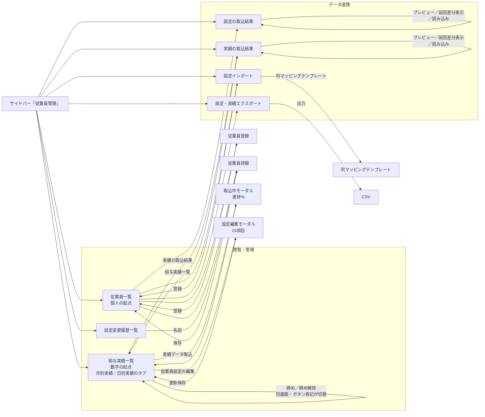

**起点は2つだけです。** 個人を触るときは**従業員一覧**から、月次の数字を見るときは**給与実績一覧**から入ります。

## 3. 主要フロー一覧

| # | フロー | 目的（一言で） | 遷移（要約） | 頻度 |
|---|---|---|---|---|
| **1** | 設定をCSVで一括登録 | 導入初日に手入力させない | 設定インポート → **従業員一覧** | 導入時 |
| **2** | 従業員を1人登録 | 採用のたびの登録 | 従業員一覧 → 従業員登録 → **従業員一覧** | 随時 |
| **3** | 給与改定を予約 | 改定日を待たずに登録し、当日まで効かせない | 従業員一覧 → 従業員詳細 →[保存]→ **従業員一覧** | **毎月** |
| **4** | 変更の経緯を追う | 「なぜこの金額か」を5分で説明する | 設定変更履歴一覧 →[名前]→ 従業員詳細 | **毎月** |
| **5** | 月次の人件費を見る | 概算と実績を突き合わせる | 給与実績一覧（タブ・モード切替のみ） | **毎月** |
| **6** | 月を締める／解除する | 数字を確定して外部へ渡す | 給与実績一覧 →[締め]→ 確認 → **給与実績一覧** | **毎月** |
| **7** | 締めた後の遡及改訂 | 確定済みの数字を動かさずに対応する | 従業員詳細 →[警告]→ 適用日付を修正 → 保存 | 随時 |
| **8** | データを外に出す | 給与計算・社労士へ渡す | 従業員一覧 → エクスポート →[出力]→ **CSV** | 随時 |
| **9** | 取込元データを確認 | 数字がおかしいときの調査／取込前の差分確認 | 設定の取込結果 ／ 実績の取込結果（プレビュー・前回差分・読み込み） | **毎月** |
| **10** | **勤怠実績を取り込む** | **人件費の実績値をシステムに入れる** | 給与実績一覧 →[実績データ取込]→ 取込中モーダル → **給与実績一覧に反映** | **毎月** |
| **11** | 給与実績一覧から設定を直す | 数字を見ながらその場で直す | 給与実績一覧 → 設定編集モーダル →[更新保存]→ 給与実績一覧 | 随時 |

**毎月回るのはフロー3〜6・9・10の6つ**です。とくに**フロー10（勤怠実績の取込）が無いと実績の数字が出ません**。ここが止まらなければ運用は回ります。

## 4. 押さえどころ（3つの設計原則）

| # | 原則 | 解く課題 | 画面での現れ方 |
|---|---|---|---|
| **①** | **設定は上書きせず、適用日付でバージョンを積む** | 過去が動く／月中改定が表現できない | 登録・詳細の「適用日付」／設定変更履歴のステータス（適用中・予約中・過去） |
| **②** | **月の確定は「締め」ひとつだけ** | ロックが二重で、どちらが効くか分からない | 給与実績一覧の「締め」ボタン（月別実績タブのみ）。従業員一覧の「確定」は**廃止** |
| **③** | **人件費は働いた店舗に付ける** | 応援分が所属店に付いたまま、店舗別PLがずれる | 給与実績一覧（実績モード）のヘルプ時間・ヘルプ人件費の列 |

**画面仕様で迷ったときは、この3つに戻れば答えが出ます。後任PdMの判断基準もここです。**

## 5. 画面一覧（全11画面）

| グループ | 画面 | 何をする画面か | 対応フロー |
|---|---|---|---|
| **閲覧・管理** | 従業員一覧 | 誰がどの設定かを見る。個人の起点 | 2・3・8 |
| | 給与実績一覧 | 月次・日次の人件費を見る。**締めを実行する** | 5・6 |
| | 設定変更履歴一覧 | 全従業員の変更履歴を横断で追う | 4 |
| **データ連携** | 設定インポート | CSVで設定を一括登録・更新 | 1 |
| | 設定・実績エクスポート | 必要な項目だけ選んでCSV出力 | 8 |
| | 設定の取込結果 | 取り込んだ**設定**の元データを確認（プレビュー／前回差分／読み込み） | 9 |
| | 実績の取込結果 | 取り込んだ**勤怠実績**の元データを確認（プレビュー／前回差分／読み込み） | 9・10 |
| （一覧から遷移） | 従業員登録 ／ 従業員詳細 | 個別の登録・編集 | 2・3 |
| （詳細から遷移） | **従業員別 給与実績** | 1名分の実績を期間で通して見る。年月範囲・給与計算モードで絞り、CSVで出力 | 5 |
| （取込から遷移） | 列マッピングテンプレート | CSV列とラクミー項目の対応づけを保存 | 1 |

**並び順の意図**：「見る」→「入れる／出す」→「入れた元を確認する」。運用中に最も頻度が高いのは閲覧なので上に置き、データ連携は下にまとめています。

---

# 第2部｜ケース別の遷移フロー

**分岐（成功・エラー・キャンセル・例外）まで含めた遷移です。** 実装・テスト設計はここを参照してください。各フローの目的・操作手順・設計判断は第3部に対応する番号があります。

---

## フロー1｜設定をCSVで一括登録する（導入時）

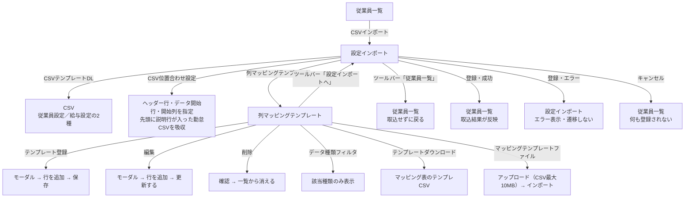

※ 列マッピングテンプレートのツールバーは、モックでは「設定インポートへ」と表記されています（旧名称・判断4）。

---

## フロー2｜従業員を1人登録する

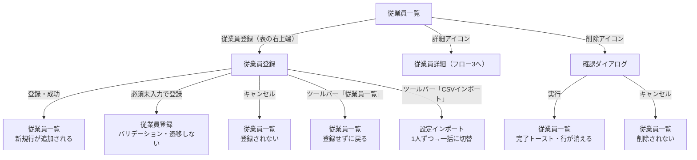

**従業員登録の画面内分岐**

| 操作 | 画面の動き |
|---|---|
| ヘルプ先店舗を選択 | その店舗ぶんの「ヘルプ先交通費」欄が自動で出る（必須） |
| ヘルプ先店舗の選択を外す | 対応する交通費欄が消える（他店の入力値は残る） |

**従業員一覧のフィルタ**

| 段 | 内容 | 何を決めるか |
|---|---|---|
| 1段目（絞り込み） | 店舗／雇用区分／名前検索 | 誰を探すか |
| 2段目（対象データ） | 月／取込データ | どのデータで見るか |
| 該当0件 | 「データはありません。」と表示 | — |

---

## フロー3｜給与改定を予約する ★適用日付の値で行き先が変わる

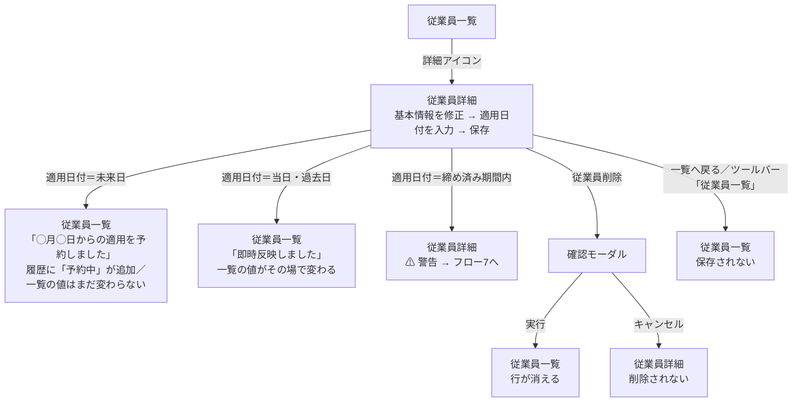

※ 適用日を迎えたあと、履歴のステータスが **予約中 → 適用中** に変わり、旧行が **過去** になります。

---

## フロー4｜変更の経緯を追う ★入口が2つ

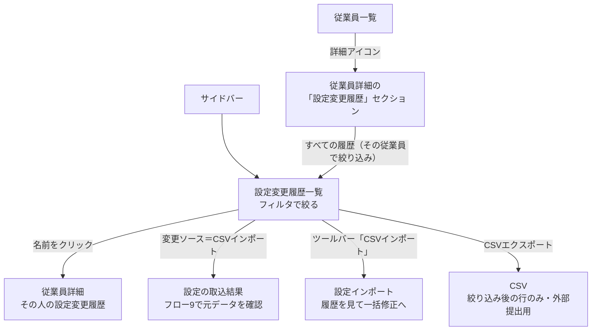

※ 入口は2つです。**横断で追う**ときは設定変更履歴一覧、**1人を追う**ときは従業員一覧から入ります。

### 概算モードで出す列（2026-08-13 判断22）

**概算モードは3画面すべてにありましたが、どの列を残すかが画面ごとにバラバラでした。**

| 画面 | 実際にあった状態 |
|---|---|
| 従業員詳細（給与実績） | 月次・日次とも**想定給与・給与・給与実績差分が無い**。給与実績なのに金額の列が1つも無かった |
| 従業員詳細 日次 | モード切替は画面にあるが、**列に印が無く何も切り替わらない** |
| 従業員別 給与実績 | 想定給与・給与実績差分はあるが**「給与」が無い**。差分の検算ができない。日次は印が無い |
| 給与実績一覧 日次 | 所属店舗労働時間から深夜残業代までに印が無く、**概算モードでも実績の列が残る** |

**決めた基準：概算モードで出すのは「実績データが無くても値が決まる列」だけです。**

| 概算モードでも出す | 実績モードだけ |
|---|---|
| 名前／日時・年月／雇用区分／所属店舗／給与単位／単位給与額／想定労働日数／想定労働時間・想定勤務時間／みなし労働時間・みなし残業時間／**想定給与** | 勤務日数／総労働時間・勤務時間／労働時間差分／みなし差分／**給与**／**給与実績差分**／所属店舗労働時間／ヘルプ先店舗／ヘルプ時間／ヘルプ人件費／深夜残業時間／深夜残業代 |

**切替の置き場所は3画面とも「月次／日次タブの下」に統一しました。** 従業員詳細だけ見出しの右にピル型で置いていましたが、**タブを切り替えたときにどちらのタブに効く操作か分かりません。** 表のすぐ上に置けば、その表の見え方を変える操作だと分かります。

**ヘルプ人件費や深夜残業代を概算に残さないのは、勤怠実績からしか出ない数字だからです。** 月初に概算モードで開いたとき、これらの列が空欄で並ぶことになります。**空欄の列は「取込が失敗した」ように見えます。**

---

### 日次の想定給与は給与単位で分ける（2026-08-13 判断25）

**判断23で「日次の想定給与 ＝ 月次の想定給与 ÷ 想定労働日数」と一本化しましたが、時給者では意味が壊れます。**

時給者の1日分は、その日に何時間入るかで変わります。月次を日数で割ると**全日を同じ額とみなす**ことになり、シフトが短い日は「予定より少ない」という差分が出ます。**シフトどおりに働いただけで差分が立つ**ので、見るべきズレが埋もれます。

| 給与単位 | 日次の想定給与 |
|---|---|
| **月給** | 月次の想定給与 ÷ 想定労働日数（1日分が固定） |
| **時給** | 単位給与額 × **その日の想定勤務時間** ＋ その日ぶんの交通費 |

**その日ぶんの交通費：** 交通費単位が日額ならその額。月額なら 単位交通費 ÷ 想定労働日数。

**これで差分の意味がそろいます。**

| 給与単位 | 差分に残るもの |
|---|---|
| 月給 | 深夜残業代・みなし超過残業代・ヘルプ人件費 |
| 時給 | 上記 ＋ **単位給与額 ×（実勤務時間 − 想定勤務時間）** |

時給者は「予定より長く入った分」が差分に出ます。これは実際に見たい情報です。

> **概算モードの日次は別です。** 実績がまだ無い時期に見るものなので、**月次の概算給与 ÷ 当月の営業日数**（判断21）を全員に使います。ここは給与単位で分けません。誰がどの日に何時間入るかが分からないためです。

---

### 想定給与に交通費を含める（2026-08-13 判断23）

**交通費は月初から確定しているのに、想定給与に入っていませんでした。** そのため給与実績差分に**毎月必ず交通費ぶんのズレが乗り**、それが基準線になって、本当に見るべきズレ（残業が増えたなど）が埋もれていました。

| | 算式 |
|---|---|
| **月次の想定給与** | 月給者：単位給与額 ＋ 所属店舗の交通費<br>時給者：単位給与額 × 所定労働時間 ＋ 所属店舗の交通費 |
| **日次の想定給与** | 月給者：月次の想定給与 ÷ 想定労働日数／時給者：単位給与額 × その日の想定勤務時間 ＋ その日ぶんの交通費（判断25） |

**所属店舗の交通費の月次換算：** 交通費単位が月額ならその額。**日額なら 単位交通費 × 想定労働日数。**

**ヘルプ先の交通費は含めません。** 全員が日額設定で、**その月に何日ヘルプへ行くかは事前に決まらない**ためです。実績側（給与）にだけ入ります。差分に残るのは「深夜残業代・みなし超過残業代・ヘルプ人件費（ヘルプ先交通費を含む）」で、**どれも勤怠実績が出て初めて決まるもの**です。差分の意味がはっきりします。

| 例（EMP-001・2026-05） | 旧 | 新 |
|---|---|---|
| 想定給与 | 320,000円 | **338,000円**（＋月額交通費18,000円） |
| 実績給与 | 357,600円 | 357,600円 |
| 給与実績差分 | 37,600円 | **19,600円** |

> **⚠️ 判断20の一部を取り消しました。** 「想定労働日数は月給者だけの項目（時給者は入力欄を出さない）」としていましたが、**日額交通費を月次に換算するのに日数が要る**ため、時給者にも必要です。入力欄を出します。

---

### 取込まわりの画面名とリンク名（2026-08-13 判断3・判断4）

**判断3：2画面は統合しません。役割が違います。**

| 画面 | 何をするか |
|---|---|
| **設定インポート** | CSVをアップして取り込む「**操作**」 |
| **設定の取込結果** | 取り込んだ結果を見る「**確認**」（取込データ名・中身・前回差分） |

**重なって見えていたのは「インポート」と「取込」が同じ意味の言葉だからです。** サイドバーに並ぶと同じ機能が2つあるように読めます。名前を変えて役割を出します。

| 旧 | 新 |
|---|---|
| 設定取込データ | **設定の取込結果** |
| 実績取込データ | **実績の取込結果** |

**統合しなかった理由：** 取り込む操作と、取り込んだ結果の確認は、使う場面が違います。導入時は操作を何度も使い、運用に入ると確認だけを見ます。1画面にまとめると、毎月見る側にアップロード欄が常に出ることになります。

**判断4：リンクのラベルは、遷移先の画面名と一字一句そろえます。「〜へ」は付けません。**

| 旧 | 新 |
|---|---|
| 従業員一覧へ | **従業員一覧** |
| 従業員設定インポート（旧名） | **設定インポート** |

**例外は「キャンセル」「戻る」「閉じる」だけです。** これは動作の名前で、遷移が目的ではありません。それ以外は、どんなに文脈で分かりそうでも画面名にそろえます（「すべての履歴」→ 設定変更履歴一覧、「すべての実績」→ 従業員別 給与実績、「一覧へ戻る」→ 従業員一覧、「CSVインポート」→ 設定インポート）。

**理由：** 画面名と違うラベルは、口頭で伝えたときに別画面だと思われます。「従業員設定インポート」は改称前の名前が残っていたもので、**同じ画面が2つの名前で呼ばれていました。**

---

### 締め後の遡及改訂の差額調整（2026-08-13 判断2）

**翌月に回す差額調整は、基本給だけを対象にします。**

**遡及改訂は単価の改定です。** 深夜割増・みなし超過・交通費は勤怠実績と実費に紐づくもので、単価が変われば自動的に再計算されます。

**全費目に広げなかった理由：** 締めた月の実績を根拠にした再計算が翌月に混ざり、**どの月の話か追えなくなります。** 締めは「その月の数字を動かさない」ための仕組みなので、そこに実績由来の再計算を持ち込むと意味が薄れます。

> **見直す条件：** 定期代の遡及改定が実務で頻発するなら、交通費を対象に加えてください。単価と違い、交通費は実費なので自動再計算では追いつきません。

---

### 想定労働日数は打刻から取る（2026-08-13 判断28）

**既定値は「直近3か月の平均出勤日数」にします。勤怠取込の打刻情報から求めます。**

判断24で「所定労働時間 ÷ 8時間」を既定値にして撤回し、判断26では時給者に既定値を置かないことにしました。**どちらも入力に頼る前提でしたが、実際の出勤日数は打刻から分かります。**

| 従業員 | 打刻から取れる出勤日数（2026-05） | 所定労働時間 ÷ 出勤日数 |
|---|---|---|
| EMP-001（正社員・月給） | 20日 | 8.0時間 |
| EMP-003（パート・時給） | **15日** | 8.0時間 |
| EMP-005（正社員・月給） | 19日 | 8.4時間 |

**社員・アルバイトの区別なく同じ方法で取れます。** 判断24が破綻したのは「所定労働時間から推測しようとした」ためで、推測せずに実績を見れば済む話でした。

**優先順位**

| 順 | 使う値 |
|---|---|
| 1 | 従業員設定の**想定労働日数**（入力があればこれが最優先） |
| 2 | **直近3か月の平均出勤日数**（打刻。3か月に満たなければ、ある月だけで平均する） |
| 3 | 打刻が1か月も無いとき … 月給者は所属店舗の**営業日数**／時給者は**既定値なし**（判断26の扱い） |

**3か月の平均にした理由：** 1か月だと、大型連休や長期休暇のあった月がそのまま今月の見込みになります。3か月ならならされます。

**3を残す理由：** 導入直後と新入社員は打刻がありません。そこで計算が止まらないようにします。

> **依存：** 実績データ取込が動いていることが前提です（仕様書 13. 前提と依存 D1）。取込前は3の扱いになります。

**判断27は変わりません。** 打刻から取れるのは**過去にいつ何時間働いたか**であって、**今月のどの日に何時間入るか**ではありません。時給者の日次の想定給与は引き続き出しません。

---

### 時給者の日次には想定給与を出さない（2026-08-13 判断27）

**シフトと連動していないため、時給者に「その日の予定」という数字が存在しません。**

判断25で「時給者の日次 ＝ 単位給与額 × その日の想定勤務時間」と決め、判断26でその想定勤務時間を「所定労働時間 ÷ 想定労働日数」と定めました。**これは平均です。**

| EMP-003（所定120時間 ÷ 想定労働日数15日 ＝ 1日8時間）が4時間のシフトだった日 | |
|---|---|
| 想定給与 | 1,200 × **8時間**（平均）＋ 600 ＝ 10,200円 |
| 給与（実績） | 1,200 × **4時間** ＋ 600 ＝ 5,400円 |
| 給与実績差分 | **−4,800円** |

**シフトが短かっただけでマイナスが立ちます。**平均との差は、見て何かを判断できる情報ではありません。

**決めたこと**

| | 時給者 |
|---|---|
| **月次の想定給与・給与実績差分** | **出す。**総労働時間 vs 所定労働時間 の比較は意味がある |
| **日次の想定勤務時間・想定給与・給与実績差分** | **出さない（「—」）。**その日の予定が存在しない |
| **日次の給与（実績）** | **出す。**単位給与額 × 実働時間 ＋ その日の交通費 ＋ 深夜残業代 ＋ ヘルプ人件費 |

**想定労働日数の用途は「日額交通費の月次換算」だけになりました。** 月給者では引き続き日次の按分にも使います。

**概算モードの日次（判断21）は変えません。** 時給者も含めます。あれは個人の1日の給与ではなく、**月の見込みを営業日でならした配分**で、店舗・全社の合計として見るものです。時給者を外すと合計が欠けます。ただし時給者は「所定労働時間どおり働けば」という前提が入るため、月給者より精度が落ちます。画面注記に明記します。

> **将来：** 勤怠システムからシフト予定を取り込めるようになれば、時給者にも日次の想定給与を出せます。そのときは「所定労働時間 ÷ 想定労働日数」ではなく**その日のシフト時間**を使ってください。

---

### 想定労働日数が無いときに何が出るか（2026-08-13 判断26）

**判断24で決めた既定値「所定労働時間 ÷ 8時間」を撤回します。** 4時間シフトの人で実態の半分になるためです。

| 例 | 所定労働時間 | 実際 | 所定 ÷ 8 |
|---|---|---|---|
| アルバイト（4時間 × 15日） | 60時間 | **15日** | 8日（**実態の半分**） |

日額交通費600円なら 600 × 8 ＝ 4,800円。実際は 600 × 15 ＝ 9,000円で、**46%の過小**です。1日に何時間入るかは所定労働時間から推測できません。

**代わりに「何が出て、何が出ないか」を決めます。**

**まず、実績のある日の「給与」は必ず出ます。** 勤怠実績の実働時間があるので 単位給与額 × 実働時間 ＋ その日の交通費 ＋ 深夜残業代 ＋ ヘルプ人件費 で計算できます。**想定労働日数は要りません。**

**想定労働日数が要るのは「想定給与」の列だけです。** 1日に何時間入る予定かが決まらないと出せません。

| 想定労働日数が**未入力**のとき | 月次の想定給与 | 概算モードの日次<br>（判断21） | 実績モードの<br>想定給与の列 | 実績モードの<br>給与の列 |
|---|---|---|---|---|
| **月給** | **正確に出る**（月給 ＋ 月額交通費。日数に依存しない） | 出る（月次 ÷ 営業日数） | 出る（月次 ÷ 営業日数の目安） | **出る** |
| **時給・交通費が月額** | **正確に出る**（単位給与額 × 所定労働時間 ＋ 月額交通費） | 出る（月次 ÷ 営業日数） | **出さない** | **出る** |
| **時給・交通費が日額** | 給与部分だけ出す（画面に「想定労働日数を入れると交通費が入ります」と表示） | 出る（給与部分 ÷ 営業日数） | **出さない** | **出る** |

**実績モードの想定給与を出さない日は、給与実績差分も「—」になります。** 比べる相手が無いためです。給与そのものは出ているので、その日いくらかかったかは分かります。

**なぜ日額交通費だけを想定給与にしないのか。** 日額交通費は1日いくらと決まっているので出せますが、**それだけでは数字になりません。**

| 時給1,200円・所定120時間・日額交通費600円 | 出せるもの | 出せないもの |
|---|---|---|
| 月次の想定給与 | 給与部分 144,000円（**94%**） | 交通費 9,000円（6%） |
| 実績モードの日次の想定給与 | 交通費 600円（**6%**） | 給与部分 9,600円（94%） |

**月次は主要な部分が出るので出す。日次の想定給与は主要な部分が出ないので出さない。** 600円だけ表示すると、実際は約10,200円の人の想定給与が600円と出ます。**店舗合計に足されると94%過小**になり、「人件費が安く済んでいる」と読めてしまいます。

**想定労働日数を入れれば、月次・日次とも出ます。**

| | 算式 |
|---|---|
| 1日の想定勤務時間 | **所定労働時間 ÷ 想定労働日数** |
| 日次の想定給与（時給） | 単位給与額 ×（所定労働時間 ÷ 想定労働日数）＋ 交通費 ÷ 想定労働日数 |
| 日次の想定給与（月給） | 月次の想定給与 ÷ 想定労働日数 |

**どちらも日次を想定労働日数ぶん足すと月次に一致します。** 例：時給1,200円・所定120時間・想定労働日数15日・日額交通費600円 → 1日 1,200 × 8 ＋ 600 ＝ 10,200円。× 15日 ＝ 153,000円 ＝ 月次の想定給与。

**想定給与を出さない人は、日別タブの想定給与と給与実績差分を「—」と出し、理由（想定労働日数が未入力）を添えます。** 給与の列は勤怠実績から出るので必ず表示されます。月次も出るので、全社の合計は欠けません。

---

### 想定労働日数の初期値（2026-08-13 判断24）

**想定労働日数は非必須です。未入力のときに何を使うかを、給与単位で分けます。**

| 給与単位 | 未入力のときに使う値 |
|---|---|
| **月給** | 所属店舗の営業日数（休業日設定から求める。判断20） |
| **時給** | ~~切り上げ（所定労働時間 ÷ 8時間）~~ → **判断26で撤回、判断28で打刻由来に。** 直近3か月の平均出勤日数 |

**時給者に営業日数をそのまま使わない理由：** 週3日勤務の人に営業日数26日を掛けると、日額交通費が 600円 × 26日 ＝ 15,600円 になります。実際は15日で9,000円なので、**6,600円の過大**です。所定労働時間から出せば実態に近くなります。

| 例 | 所定労働時間 | 初期値 |
|---|---|---|
| パート（週3日） | 120時間 | 120 ÷ 8 ＝ **15日** |
| アルバイト（週2日） | 80時間 | 80 ÷ 8 ＝ **10日** |
| アルバイト（短時間） | 60時間 | 60 ÷ 8 ＝ 7.5 → **8日** |

**画面には初期値を薄字（プレースホルダ）で出します。** 保存はしません。**保存してしまうと、所定労働時間を変えたときに古い日数が残る**ためです。上書きしたい人だけ入力します。

**「未入力なら概算給与を出さない」は採りませんでした。** 全社の概算合計からその人が抜け、**合計が静かに過小になる**ためです。月初に「今月いくらかかるか」を見るのが概算モードの目的なので、一部が欠けた合計はいちばん困る壊れ方です。

---

### 想定労働日数（2026-08-13 判断20）

**判断1（月給 ÷ 当月の所定労働日数）を確定していたのに、その日数をどこにも持っていませんでした。** 画面には「想定労働日数」の列があり、算式も決まっているのに、値の出所が未定義でした。

| 出所 | 扱い |
|---|---|
| **所属店舗の休業日設定** | **月給者の既定値**。その月の日数 − 休業日数 ＝ 営業日数。月ごと・店舗ごとに自動で決まる（時給者の既定値は判断24） |
| **従業員設定の「想定労働日数」** | **上書き用の任意項目**。営業日数と違う契約の人が入力 |

**休業日設定を出所にした理由：** 月次予算設定の営業日数より**上流**です。休業日設定は定休日（曜日・祝日）と日付指定の上書きを持っていて、**月が変われば営業日数も自動で変わります。** 手入力の値のような更新漏れが起きません。店舗ごとに定休日が違っても正しく出ます。ヘルプ勤務がある人も、**所属店舗**の休業日設定を見ます。

**⚠️ 営業日数は「店が開いている日数」であって「その人が働く日数」ではありません。**

| | 例 |
|---|---|
| 定休日 | 火曜のみ |
| 2026年8月の営業日数 | **26日** |
| 週休2日の正社員が実際に働く日数 | **21日前後** |
| 350,000 ÷ 26 | 13,461円/日 → 21日分で **282,700円**（月給と67,300円ずれる） |

**定休日が少ない店舗ほどズレが大きくなります。** そのため、**月給者は想定労働日数を入力する**運用が要ります。既定値は「入力が無いときに計算を止めないための値」であって、正確な値ではありません。

| 従業員の例 | 想定労働日数 | 実際に使う値 |
|---|---|---|
| 正社員（月給・週休2日） | **21**（入力を推奨） | 21日 |
| 正社員（未入力） | 未入力 | 所属店舗の営業日数（既定値。ズレる可能性あり） |
| パート・アルバイト（時給・週3日） | **15** | 15日（日額交通費の月次換算に使う） |

**日次の想定給与：**

| 給与単位 | 算式 |
|---|---|
| 月給 | 単位給与額 ÷ 想定労働日数 |
| 時給 | 単位給与額 × その日の実働時間（日割り不要） |

> **訂正（2026-08-13 判断23）：** ここには当初「想定労働日数は月給者だけの項目。時給者は入力欄を出さない」と書いていました。**判断23で想定給与に交通費を含めたことで、日額交通費の月次換算（単位交通費 × 想定労働日数）に日数が要るようになりました。** 時給者にも必要です。入力欄を出し、検証データにも値を入れています。

**配置：** 従業員登録・従業員詳細・設定編集モーダルの、**所定労働時間の左**。非必須。

> **他機能への依存：** 営業日数は**休業日設定**（店舗スコープ）から求めます。**休業日設定が未設定の店舗では既定値が取れません。** その場合は従業員ごとの入力が必要になります。実装時に未設定時の扱いを決めてください。

---

### 店舗単位で見る導線（2026-08-13 判断17）

**「店の全従業員の実績・履歴を見る画面」は新設しません。** すでに給与実績一覧と設定変更履歴一覧があり、どちらも店舗フィルタとCSV出力を持っています。

| 軸 | 1名 | 全従業員 |
|---|---|---|
| 設定変更履歴 | 従業員詳細（直近3件） | **設定変更履歴一覧** |
| 給与実績 | 従業員別 給与実績 | **給与実績一覧** |

**足りないのは導線です。** 従業員一覧で店舗を絞っても、そこから店舗の実績・履歴へ行けませんでした。

| 追加する導線 | 遷移先 |
|---|---|
| この店舗の給与実績一覧 | 給与実績一覧（同じ店舗で絞り込み済み） |
| この店舗の設定変更履歴へ | 設定変更履歴一覧（同じ店舗で絞り込み済み） |

**絞り込みを引き継ぐことが条件です。** 引き継がないと、遷移先でもう一度店舗を選ぶことになり、いまより手数が増えます。

**画面を新設しなかった理由：** 給与実績一覧と役割が同じで名前も似た画面が増えます。判断3・4（画面名の統一）が未確定のまま、混乱を増やすことになります。

---

### 概算モードは3画面すべてに置く（2026-08-13 判断16）

**実績データを取り込むまで、実績モードの金額は出ません。** 月初と月中は実績が無いため、実績モード固定にすると**いちばん見たい当月が空欄**になります。

| 画面 | 概算／実績の切替 | 想定給与・給与実績差分 |
|---|---|---|
| 給与実績一覧（月別） | あり | あり |
| 従業員別 給与実績 | あり | **追加**（判断16） |
| 従業員詳細（給与実績） | **追加**（判断16） | — |

**判断12（詳細は絞り込みを持たない）とは矛盾しません。** モード切替は**表示の切替**で、月次／日次タブと同じ性質です。期間の絞り込みとCSV出力は一覧に置いたままです。

**切替を残す理由は2つ：**
1. **実績が出る前に金額を見る**（月初・月中）
2. **実績が出た後でも理論値を見る**（想定どおりだったかを確かめる）

2があるため、自動判定（実績があれば実績・なければ概算）では足りません。**人が選べる必要があります。**

**給与実績差分＝給与 − 想定給与。** 想定どおりだったかがこの1列で読めます。

---

### 従業員のID体系（2026-08-13 判断15）

**勤怠システムのコードをそのまま従業員の識別子にしません。** ラクミー側で従業員IDを付番し、勤怠システムのコードは「外部ID」として別に持ちます。

| ID | 誰が決めるか | 役割 |
|---|---|---|
| **従業員ID**（E0001〜） | **ラクミーが自動付番** | 従業員の同一性。**設定変更履歴と実績はこれに紐づく** |
| **外部ID** | 勤怠システム | 取込時の突合キー。**勤怠システムごとに複数持てる** |
| 従業員コード | 顧客が入力 | 人が読む識別子（社員番号など） |

**取込の流れ：** 勤怠CSVの外部ID → 外部ID対応表 → 従業員ID → 実績・設定を紐づける

**なぜ分けるか：** 勤怠システムを乗り換えると外部IDが変わります。それを識別子にしていると、**過去の履歴と実績が切れます**。従業員IDで紐づけておけば、外部IDを付け替えるだけで済みます。

**複数持てるようにした理由：** King of Timeとジョブカンを併用する顧客がいます。1名が2つの外部IDを持つ状態（E0001＝King of Time 1001／ジョブカン JB-001）を許容します。

**対応表に無い外部IDは取り込みません。** 黙って新規登録すると、同じ人が二重に増えます。件数と理由を表示して止めます。ただし**新規採用の取込では付番して受け入れます**（T-I03の1013がこのケース）。

> **列マッピングテンプレートとの違い：** あちらは**列名**の対応（従業員コード／スタッフコード）。外部ID対応表は**ID値**の対応です。両方ないと取り込めません。

---

### 交通費は人件費に含めて表示する（2026-08-13 判断14 ／ 判断6の見直し）

**判断6では交通費を独立費目としていましたが、一覧とエクスポートでは人件費に含める形に変えます。** 設定側（単位交通費・ヘルプ先交通費）は入力項目として残ります。

| 区分 | 扱い |
|---|---|
| **設定（従業員登録・詳細・CSVインポート）** | **単位交通費・ヘルプ先交通費を入力項目として保持**（変更なし） |
| **一覧（給与実績一覧・従業員別 給与実績）** | 交通費の列を出さない。**人件費に含めて表示** |
| **エクスポート** | 交通費の項目を出さない |

**含め方：**

| 項目 | 新しい定義 |
|---|---|
| 実績給与（人件費） | 概算給与 ＋ 深夜残業代 ＋ みなし超過残業代 ＋ **ヘルプ先の交通費**　※所属店舗の交通費は概算給与に含む（判断23） |
| ヘルプ人件費 | （**給与部分** × ヘルプ時間 ÷ 総労働時間）＋ **ヘルプ先の交通費**　※給与部分＝（概算給与 − 所属店舗の交通費）＋深夜残業代＋みなし超過残業代（交通費を除く） |

**按分の基礎に交通費を入れないのが要点です。** 交通費は実費なので時間で割りません。所属店舗の通勤費まで按分すると、応援先に通勤費の一部が移ってしまいます。

**実績給与に交通費を両方含めるのも要点です。** 所属店舗分だけを含める形にすると、**ヘルプ先の交通費が全社合計から抜け落ちます**（応援先には足されるが、どこからも引かれないため）。両方を含めたうえで、ヘルプ人件費として応援先へ振り替えると、店舗別合計＝全社が保たれます。

| 検算（EMP-001・2026-05） | 金額 |
|---|---|
| 実績給与（人件費） | 357,600円 |
| ├ 所属店舗に残る | 312,768円 |
| └ 応援先へ振り替え（ヘルプ人件費） | 44,832円 |

**総支給額の列は削除します。** 実績給与と同じ値になるためです。

**日別実績では月額の交通費を出勤日で按分します。** 日次人件費の合計が月次の実績給与と一致する必要があるためです（端数は最大剰余法で配分）。

---

### 従業員詳細は「ダイジェスト」、通して見るのは一覧（2026-08-13 判断12）

**従業員詳細の設定変更履歴と給与実績は、直近を見せるだけの欄です。** そのため**絞り込みとCSVエクスポートは詳細には置きません**。過剰な機能で画面が長くなり、本来の役割（いまの設定を確かめる・保存できたか確かめる）が埋もれます。

| 画面 | 役割 | 持たせる機能 |
|---|---|---|
| **従業員詳細** | いまの設定＋**直近**の履歴・実績。保存できたかを確かめる | 表示のみ。絞り込み・出力は持たない |
| **設定変更履歴一覧**（既存） | 設定変更を通して見る | 変更ソース・店舗・雇用区分・編集日時範囲・氏名で絞り込み／CSV出力 |
| **従業員別 給与実績**（新規） | 1名分の実績を通して見る | 年月**範囲**・給与計算モード／月次・日次タブ／CSV出力 |

**従業員別 給与実績を新設する理由：** 給与実績一覧は「**年月（単月）× 全従業員**」の画面で、従業員名で絞っても1行しか出ません。**1名を期間で通して見る場所が存在しない**ためです。詳細の給与実績は「1名 × その年」でしたが、年をまたげませんでした。

**詳細から外す機能：**

| 外すもの | 移す先 |
|---|---|
| 設定変更履歴のCSVエクスポート | 設定変更履歴一覧 |
| 給与実績の年フィルタ | 従業員別 給与実績（年月範囲に拡張） |
| 給与実績の**期間の絞り込み** | 従業員別 給与実績　※**給与計算モードの切替は詳細にも残す**（判断16。表示の切替であり絞り込みではない） |
| 給与実績のCSVエクスポート（月次・日次） | 従業員別 給与実績 |

---

### 給与実績一覧のモーダルにも適用日付を置く（2026-08-13 判断32）

**判断10で「どちらから編集しても適用日付と設定変更履歴を同じように記録する」と決めていましたが、モーダル側に適用日付の入力欄がありませんでした。**

| 入口 | 適用日付 |
|---|---|
| 従業員詳細 | あった |
| **給与実績一覧の設定編集モーダル** | **無かった** |

**指定できないと、原則①（適用日付でバージョン管理）がこの入口だけ機能しません。** 何も指定しないなら当日固定になり、**この入口からは予約ができず、締め済み期間への警告（AC-04）も出せません。**

**モーダルにも従業員詳細と同じ規則で適用日付を置きます。**

- 未来日 ＝ 予約／当日・過去 ＝ 即時反映
- 締め済み期間の日付を入れたら警告を出し、反映しない（フロー7と同じ）

**入口が2つある以上、両方が同じ規則で動く必要があります。** 片方だけ規則が違うと、どちらから直したかで履歴の意味が変わります。判断10の「更新処理の共通化」（R-06）は、画面の入力項目までそろって初めて成り立ちます。

---

### 取込エラーがある行の扱い（2026-08-13 判断30）

**給与実績一覧にエラーの絞り込み（交通費欠損・出退勤打刻漏れ）がありましたが、その行の金額をどう出すかが決まっていませんでした。**

| エラー | 金額の扱い |
|---|---|
| **交通費が設定されていない** | **交通費を0円として計算する。**金額は出す |
| **出退勤の打刻漏れ** | **その日を出勤日に数えない。**日次の行も作らない |

**交通費を0で出すのは、金額を出さないと全社の合計が欠けるからです。** 交通費は人件費全体から見れば小さく、0でも合計は概ね正しく出ます。エラーの絞り込みで見つけて直せます。

**打刻漏れの日を出勤日に数えないのは、その日いくら働いたか分からないからです。** 出勤日に数えると、**判断28の想定労働日数（直近3か月の平均出勤日数）が実態より多くなります。**

**⚠️ 打刻漏れは想定労働日数に効きます。** 打刻漏れを放置すると出勤日数が減り、月額交通費の日割りや月給者の日次按分が変わります。エラーの絞り込みで毎月確認してください。

**あとから出勤にしたいとき**

| 状態 | 手順 |
|---|---|
| **未締め** | 勤怠システム側で打刻を直し、**その月を取り込み直す** |
| **締め済み** | **締めを解除して**取り込み直し、もう一度締める。解除の記録が残る |

**ラクミー側で打刻を直せるようにはしません。** 勤怠システムと数字が食い違い、どちらが正しいのか分からなくなります。ラクミーは取り込んだものを見る側です。

**締め済みでも翌月調整にしないのは、打刻漏れが実績の誤りだからです。** 判断2の翌月差額調整は「設定の遡及改訂」に使うもので、実績の誤りを翌月に付け替えると、その月の人件費が実態とズレたまま残ります。

---

### 在籍状態を持つ（2026-08-13 判断31）

**退職者を表す状態がなく、退職＝削除しかありませんでした。**

| | |
|---|---|
| **在籍状態** | 在籍／退職。従業員マスタに持つ（雇用区分の左） |
| **退職にすると** | 従業員一覧から外れる。**過去の実績と設定変更履歴はそのまま残る** |
| **削除できるのは** | **実績が1件も無い従業員だけ**（誤登録の取り消し用） |

**実績がある従業員を削除できないようにしたのは、締めた月の人件費が動くからです。** AC-16（締め済みの月は数字が動かない）に抵触します。退職者は削除ではなく在籍状態で外します。

**一覧から外すだけで、給与実績一覧の過去月には出ます。** その月に在籍していた事実は変わらないためです。

---

### 設定変更履歴の操作はステータスで変える（2026-08-13 判断29）

**適用済みの履歴を消せると、過去の数字が動きます。** 設計原則②（締めはひとつ）と同じ理屈で、履歴は「起きたことの記録」なので、起きた後に書き換えられてはいけません。

| ステータス | 操作 | 理由 |
|---|---|---|
| **予約中** | **編集／削除** | まだ数字に反映されていない。取り消せる |
| **適用中** | **表示のみ** | すでに数字に反映されている。消すと過去の金額が変わる |
| **過去** | **表示のみ** | 同上。締めた月に含まれている可能性もある |

**直したいときは、新しい適用日付で登録します。** 履歴を書き換えるのではなく、次の設定を積むのが原則①（適用日付でバージョン管理）です。

**「表示」の中身は画面によって違います。**

| 画面 | 押したときの動き |
|---|---|
| 従業員詳細の設定変更履歴 | **その行の設定内容を読み取り専用モーダルで開く**。すでにその従業員の詳細にいるため、詳細画面へ遷移させても意味がない |
| 設定変更履歴一覧 | **その従業員の従業員詳細へ遷移する**。全従業員が並ぶ画面なので、対象を開く導線が要る |

**設定変更履歴一覧には操作列がありませんでした。** 今回新設しています。

---

### 従業員詳細の「設定変更履歴」セクションの表示ルール（2026-08-13 判断11）

**この欄の役割は「いま保存した設定が、意図したとおりに記録されたか」をその場で確かめることです。** 過去の全件を追うのは設定変更履歴一覧の役割なので、詳細では**確認に必要な分だけ**を出します。

| # | ルール | なぜ |
|---|---|---|
| **1** | **直近3件だけを表示する**（予約中があるときは必ず含める） | 全件表示だと縦に伸び、下の給与実績まで遠くなる。確認に要るのは 予約中・適用中・直前の過去 の3件 |
| **2** | **並び順は変更反映日時の降順**（予約中が最上部） | 保存した行が必ず一番上に来る。現状は降順でも昇順でもなく、予約した行が最下部にあり探しにくい |
| **3** | **ステータスは変更反映日時の次（2列目）に置く** | 一番知りたい列が11列目にあり、横スクロールすると見えない |
| **4** | **1つ古い行と値が違う項目を強調する** | 何を変えたのかが13列の中から読み取れない。取込データの「前回差分表示」と同じ考え方 |
| **5** | セクション右上に「**すべての履歴**」を置き、**その従業員で絞り込んだ状態**で設定変更履歴一覧遷移する | 4件目以降を見る導線が無い。素の一覧に飛ばすと名前で探し直すことになり、いまより手数が増える |

**5の絞り込みが条件です。** 絞り込まずに遷移すると改善になりません。

>**この5点は受入条件を満たすかどうかとは別の話です。** 現状のモックでも AC-07・AC-08・AC-09 は満たしています。満たしていないのは「確認のしやすさ」で、そこは条件化されていませんでした。**AC-52・AC-53 として追加します。**

---

## フロー5｜月次の人件費を見る ★画面は1つ。タブとモードの切替だけ

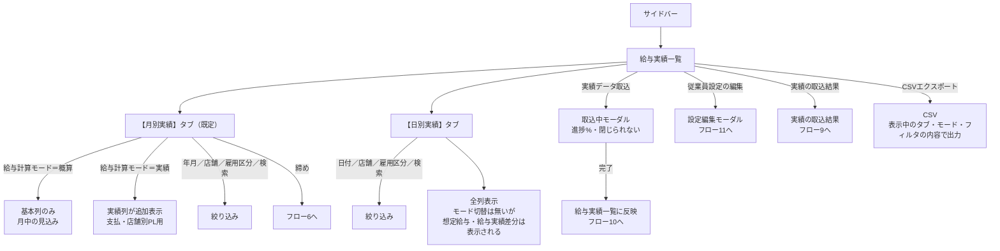

**個人単位で見る場合**

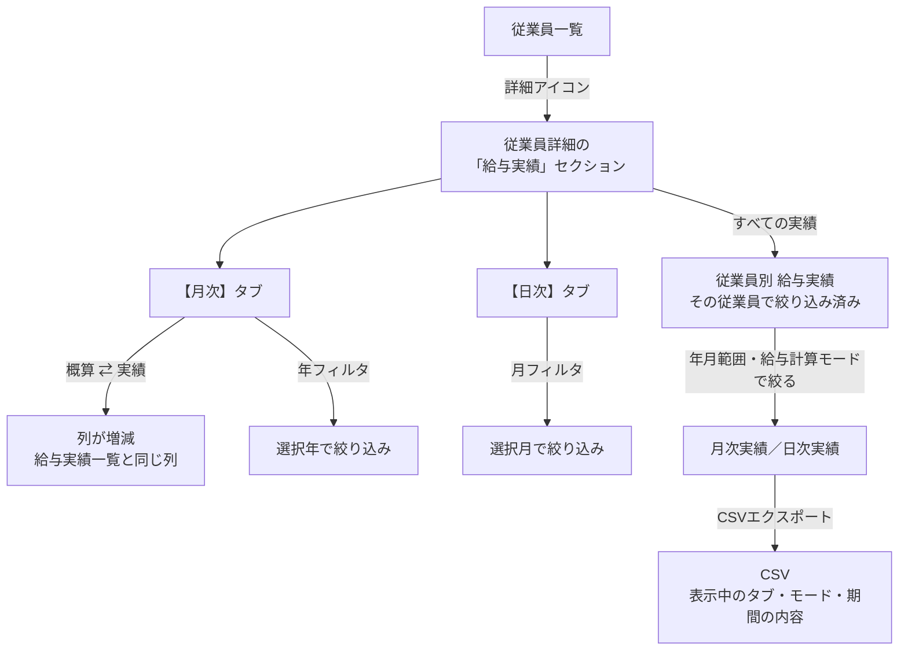

※ 詳細の給与実績は個人向けに列を絞った構成（月次17列・日次14列）です。給与実績一覧（月別26列・日別21列）とは別のものです。**詳細では直近3か月を実績モードで表示するのみ**で、期間の絞り込みとCSV出力は**従業員別 給与実績**で行います（判断12）。

---

## フロー6｜月を締める／解除する ★同じ画面に留まり、ボタン表記が切り替わる

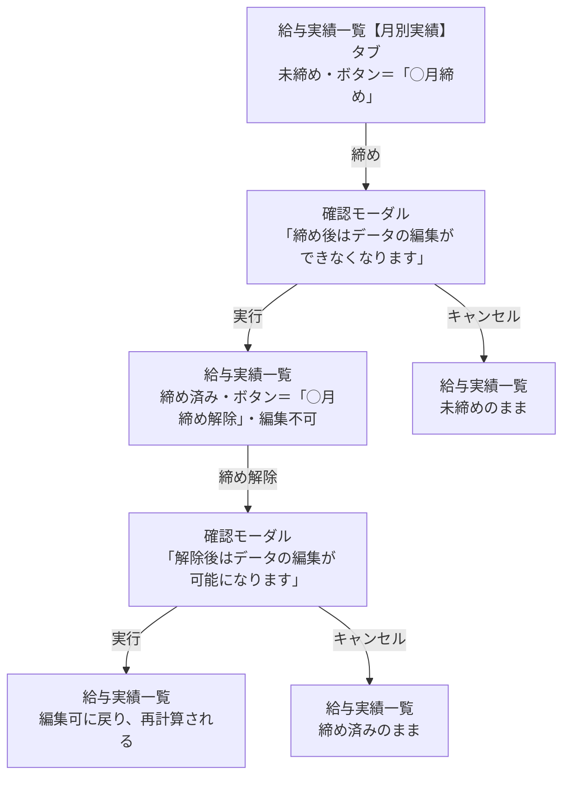

※【日別実績】タブでは締めボタンは表示されません（締めの単位は「月」のため）。

---

## フロー7｜締めた後の遡及改訂 ★3つの対応で行き先が分かれる

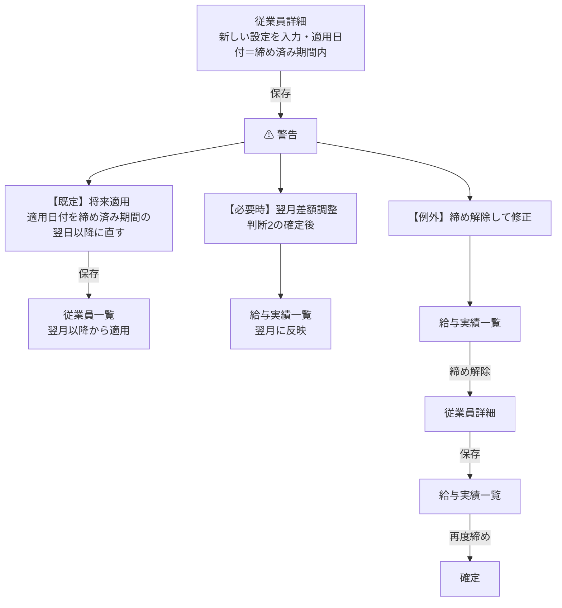

※【例外】の経路では**確定済みの数字が動きます**。記録は残りますが常用しません。

---

## フロー8｜データを外に出す ★①の選び方で②の中身と出力ファイル数が変わる

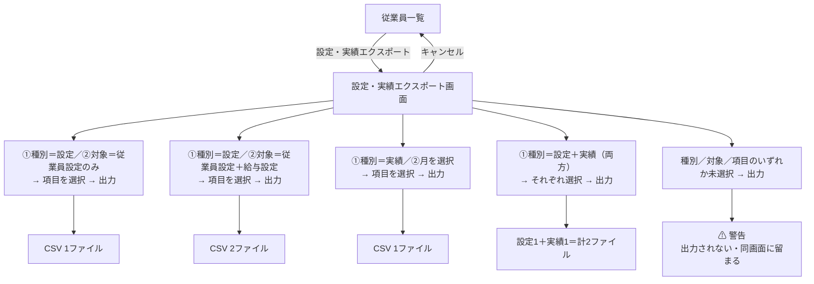

---

## フロー9｜取込元データを確認する ★入口が3つ

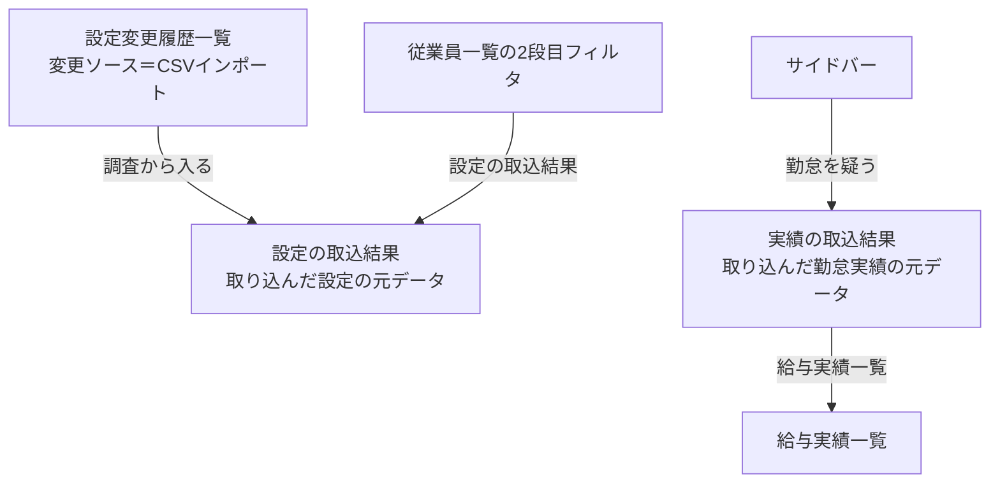

**取込データ一覧の各行でできること**（設定の取込結果・実績の取込結果 共通）

| 操作 | 内容 |
|---|---|
| プレビュー | 取込内容の一覧（設定＝11項目／実績＝総労働時間・給与・交通費 ほか） |
| 前回差分表示 | 前回取込との差分（例：田中太郎 単位給与額 前回320,000→新規340,000） |
| 読み込み | 取込中モーダル（進捗%）→ 完了で取り込まれる |
| タブ | 設定の取込結果＝従業員設定／給与設定　実績の取込結果＝月別データ／日別データ |

**切り分けの順序**

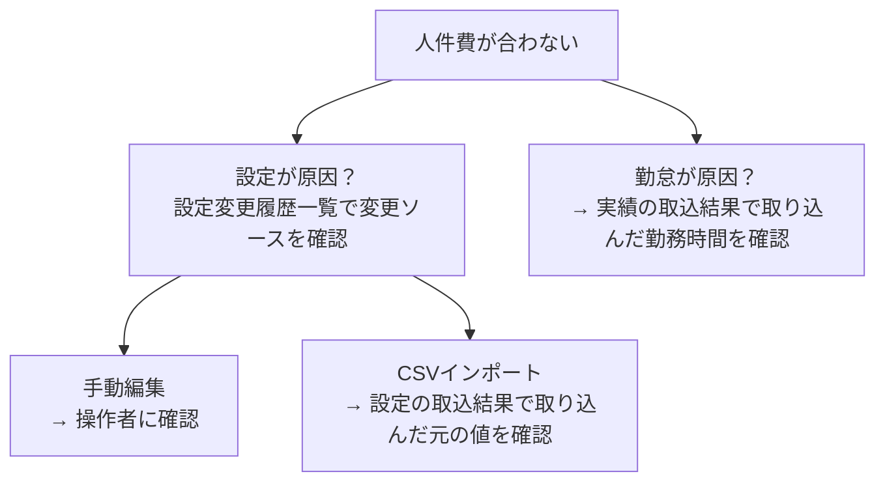

---

## フロー10｜勤怠実績を取り込む ★人件費の実績値の源泉

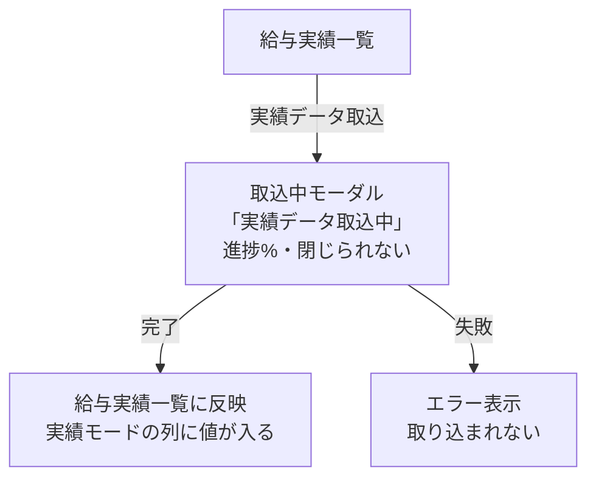

**取り込む前に中身を確かめたいとき**


**この取込を行うまで、実績モードの金額は出ません。** 締め（フロー6）はこの取込の後に実行します。

---

## フロー11｜給与実績一覧から設定を直す

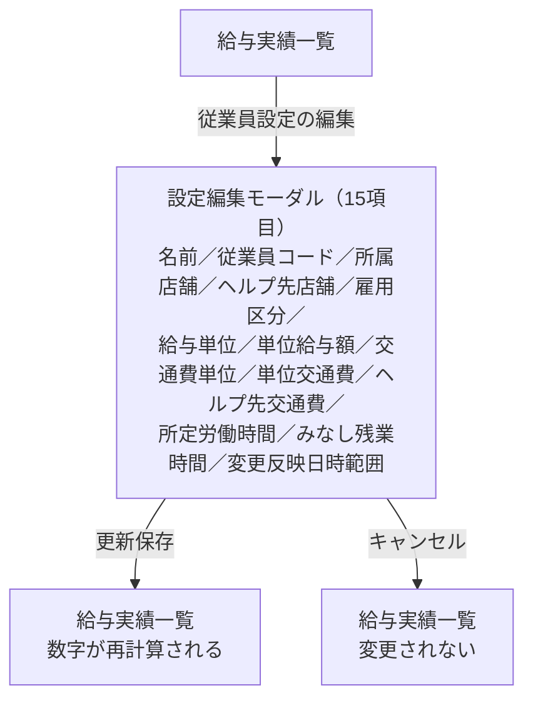

> ⚠️ **設定を編集できる入口が2つあります**（従業員詳細＝フロー3／このモーダル＝フロー11）。
> どちらから編集しても、適用日付と設定変更履歴が同じように記録される必要があります（判断10＝A で確定）。

---

# 第3部｜フロー詳細

各フローに「**目的**」「**誰が**」「**操作手順**」「**この設計にした理由（＝PdM判断の記録）**」「**検証状態**」を記載します。遷移は第2部を参照してください。

---

## フロー1｜設定をCSVで一括登録する

**対応ストーリー：US-05** ／ **目的：** 導入初日に従業員を1人ずつ手入力させない。50名いれば50回×12項目の入力になり、それだけで導入が止まります。既存の勤怠システム（King of Time／ジョブカン）から出したCSVを、**列の対応づけだけで**取り込める状態にします。

**誰が：** 導入担当（CS）またはお客様の管理者

**操作手順**

1. サイドバー「従業員管理 → 設定インポート」を開く
2. **CSVテンプレートをダウンロード**（画面右上）
   - **「従業員設定CSVテンプレート」** … 従業員コード / 氏名 / 雇用区分 / 所属店舗 / ヘルプ先店舗（`;`区切り）/ 想定労働日数 / 適用日付
   - **「給与設定CSVテンプレート」** … 従業員コード / 給与単位 / 単位給与額 / 交通費単位 / 単位交通費 / ヘルプ先交通費（`店舗:金額;`）/ 所定労働時間 / みなし残業時間 / 適用日付
   - いずれもBOM付きCSV（Excelで開いても文字化けしない）
3. **データ種類**を選ぶ … King of Time ／ ジョブカン ／ 新規作成
4. **列マッピングテンプレート**を選ぶ（既存のものがあれば取込列設定が自動で埋まる）
5. CSVファイルをドラッグ＆ドロップ
6. 必要なら **CSV位置合わせ設定**を開く（ヘッダー行・データ開始行・開始列を指定。勤怠システムの出力は上部に余計な行が入ることが多いため）
7. **取り込み列設定**テーブルで、CSV列 → ラクミー項目の対応を確認（「**全解除**」で取込チェックを一括で外せます）
8. 「登録」→ 完了 → 従業員一覧戻る

**列マッピングテンプレートを作る場合（初回のみ）**

1. 設定インポート画面の「列マッピングテンプレート」
2. 「テンプレート登録」→ テンプレート名・データ種類（新規作成（従業員設定）／新規作成（給与設定）／King of Time／ジョブカン）
3. 列マッピング設定テーブルで、CSV列名 → 反映先テーブル → ラクミー列名 を行ごとに設定（「**行を追加**」で行を増やす）
4. 「**保存**」（編集時は「**更新する**」）→ 以降のインポートで選ぶだけになる
5. 行数が多い場合は「**テンプレートダウンロード**」でマッピング表のCSVを取得し、記入して「**マッピングテンプレートファイル**」からアップロード（CSV最大10MB）→ **インポート**で一括登録できる

**この設計にした理由（PdM判断）**

**勤怠システムごとのヘッダー表記ゆれを、実装ではなく"設定"で吸収します。** King of Time は「従業員コード / 氏名 / 雇用区分」、ジョブカンは「スタッフコード / スタッフ名 / 雇用形態」と、同じ意味の列が違う名前で出ます。これをコードに埋め込むと、新しい勤怠システムの顧客が来るたびに開発が必要になります。テンプレート化により**CSが自分で対応できる**状態にしました（K4の前提）。

**従業員設定と給与設定を別テンプレートに分けたのは、更新頻度が違うためです。** 所属店舗の異動は年に数回、給与改定は別のタイミングで来ます。1枚のCSVにすると、給与だけ直したいときに従業員情報まで再送することになり、意図しない上書き事故が起きます。

**検証状態：** 画面・テンプレートDL・D&D・列設定表示は**【検証済み】**。**取込の実行・バリデーション・保存は【未検証】**。異常系CSV（`data/09`：コード欠落・給与額の負値・存在しない店舗S99・型不正`abc`・未定義の雇用区分「契約社員」）の挙動は実装後の検証項目です（T-I05）。

---

## フロー2｜従業員を1人登録する

**対応ストーリー：US-02** ／ **目的：** 中途入社・アルバイト採用のたびに発生する、最も頻度の高い操作。**この画面の入力項目が、そのまま人件費の計算根拠**になります。

**誰が：** 店長または本部の管理担当

**操作手順**

1. 従業員一覧の**表の右上端**にある「従業員登録」を押す
2. 基本情報を入力
   - 名前 / 従業員コード / **所属店舗（1つ）** / **ヘルプ先店舗（複数可）** / 雇用区分（正社員・パート・アルバイト）
   - 給与単位（月給・時給）/ 単位給与額 / 交通費単位（日額・月額）/ 単位交通費
   - **ヘルプ先交通費** … ヘルプ先店舗を選ぶと**店舗ごとの入力欄が自動で出る**（必須）
   - 所定労働時間 / みなし残業時間
3. **適用日付**を選ぶ（カレンダー・必須・既定は当日）
   - 配置は所定労働時間／みなし残業時間の**下の行**（登録・詳細で統一）
4. 「登録」→ 完了 → 従業員一覧戻る

**この設計にした理由（PdM判断）**

**ヘルプ先交通費を店舗ごとに個別入力させているのは、距離が違うからです。** 渋谷店所属の人にとって青山店（700円）と新宿店（900円）では実費が違います。1つの値にまとめると、遠い店に応援に行くほど持ち出しになり、**現場が応援を断る理由**になります。原則③（人件費を働いた店舗に付ける）を、交通費まで貫いた形です。

**適用日付を「所定労働時間の下」に固定配置したのは、入力の最後に来る項目だからです。** 登録画面と詳細画面で位置を変えると、詳細画面で「適用日付を触らずに保存」する事故が起きます。**同じ項目は同じ場所**に置きます。

**検証状態：** 入力・通貨の千区切り表示・ヘルプ先交通費の動的表示／解除・遷移は**【検証済み】**。保存と適用日付の判定は**【未検証】**。

---

## フロー3｜給与改定を「先に」登録しておく（予約）

**対応ストーリー：US-02** ／ **目的：** 4/1昇給を3月中に登録し、**当日を待たずに、しかし当日まで効かせない**。給与改定の連絡は事前に来るのに、システムには当日入力しないと反映されない——この時間差を吸収します。**本機能の中心的な価値です。**

**誰が：** 本部の管理担当

**操作手順**

1. 従業員一覧の行の「詳細」アイコン → 従業員詳細
2. **基本情報**セクションで、変更したい値を直す（例：単位給与額 320,000 → 340,000）
3. **適用日付**に**未来の日付**を入れる（例：2026-08-01）
4. 「保存」→ **「2026-08-01からの適用を予約しました」**と表示
5. 同じ画面の**設定変更履歴**セクションに、ステータス「**予約中**」の行が追加される
6. 8/1が来ると、その行が「適用中」になり、それ以前の行は「過去」になる

**当日・過去日を入れた場合：** 「即時反映しました」と表示され、その時点から新しい設定で計算されます。

**この設計にした理由（PdM判断）**

**「更新予約」ボタンと日付選択モーダルを廃止し、適用日付1つに統合しました。** 旧仕様では「保存」と「更新予約」の2ボタンがあり、押し間違えると即時反映されました。統合後は**日付を見れば結果が決まる**（未来＝予約／当日以前＝即時）ため、押し間違いが構造的に起きません。**ボタンを減らしたのではなく、判断の分岐を人間から日付に移した**という設計です。

**予約を別画面にしなかったのは、「何を変えるか」と「いつから変えるか」は同時に決まるからです。** 昇給の連絡は「4/1から◯◯円」という一体の情報で来ます。画面を分けると、片方だけ入力された中途半端な状態が生まれます。

**検証状態：** 画面・履歴表示・ステータス（適用中／予約中／過去）は**【検証済み】**。予約の自動適用・保存時のメッセージ分岐は**【未検証】**。

---

## フロー4｜「誰の設定が、いつ、なぜ変わったか」を追う

**対応ストーリー：US-04** ／ **目的：** 人件費の数字を疑われたときに**5分で説明できる**状態にする。「6月の人件費が5月より高い」→「6/1に3名の昇給が適用されています」と即答できるかが、この機能が信用されるかの分かれ目です。**K2（問い合わせ0件）の直接の手段。**

**誰が：** 本部の管理担当・経理

**操作手順（横断で追う場合）**

1. サイドバー「従業員管理 → 設定変更履歴一覧」
2. フィルタで絞る
   - **変更ソース** … 手動編集 ／ 更新予約 ／ CSVインポート(King of Time) ／ CSVインポート(ジョブカン)
   - 店舗 ／ 雇用区分 ／ **編集日時の範囲**（期間指定）／ 従業員名検索
3. 表で確認する（名前から従業員詳細へリンク）
   - 変更反映日時 / 雇用区分 / 給与単位 / 単位給与額 / 交通費単位 / 単位交通費 / 所定労働時間 / みなし残業時間 / 所属店舗 / ヘルプ先店舗 / **ステータス** / **編集日時** / **変更ソース**（一覧は先頭に「名前」、詳細は末尾に「操作」が付き、それぞれ14列）
4. CSVエクスポートで外部提出用に出す

**この設計にした理由（PdM判断）**

**「変更反映日時」と「編集日時」を両方持っています。** 前者は*いつから効くか*（適用日付）、後者は*いつ入力されたか*です。この2つは一致しません。6/25に入力した8/1適用の予約は、「6/25に誰かが操作した」記録と「8/1から金額が変わる」事実の両方が必要です。**片方だけでは監査に答えられません。**

**変更ソースを記録しているのは、事故の切り分けのためです。** 金額がおかしいとき、まず知りたいのは「人が入れたのか、CSVが入れたのか」です。CSVインポートなら取込ファイルを見に行けばよく（フロー9）、手動編集なら操作者に聞けばよい。**次にどこを見るかが決まる**情報を持たせています。

**検証状態：** 画面・全14列（名前＋13項目）・フィルタ（変更ソース／店舗／雇用区分／編集日時範囲／従業員名検索）・リンクは**【検証済み】**（`employee_payroll_histories.html` は作成済み）。フィルタの絞り込み結果とCSV出力内容は**【未検証】**。

---

## フロー5｜月次の人件費を確認する（概算 ↔ 実績）

**対応ストーリー：US-03** ／ **目的：** 月中は「だいたいいくらか」、月末は「実際にいくらか」を見る。この2つは**用途が違うので画面を分けず、同じ表のモード切替**にします。

**誰が：** 経営者・本部・（次段階で）店長

**操作手順**

1. サイドバー「従業員管理 → 給与実績一覧」
2. **月別実績**タブ（既定）でフィルタを設定：年月 ／ **給与計算モード（概算・実績）** ／ 店舗 ／ 雇用区分 ／ 検索
3. **概算モード**：基本列のみ表示
   - 従業員コード / 氏名 / 対象年月 / 雇用区分 / 所属店舗 / **概算給与**
   - ＝ 単価 × 想定時間。**月中でも常に出る**数字。予算対比・見込みに使う
4. **実績モード**に切り替え：実績列が追加表示される（モック実測・全26列）
   - **常時表示（11列）**：名前／従業員ページ／従業員設定／従業員コード／雇用区分／給与単位／単位給与額／勤務日数／所属店舗／**交通費**／**総支給額**
   - **実績モードで追加（15列）**：想定労働日数／想定労働時間／総労働時間／労働時間差分／みなし労働時間／みなし労働時間差分／想定給与／給与／給与実績差分／所属店舗労働時間／ヘルプ先店舗／ヘルプ時間／**ヘルプ人件費**／深夜残業時間／深夜残業代
   - ＝ 勤怠取込後の実データ。**支払と店舗別PLに使う**数字
   - **交通費と総支給額は常時表示**です（判断6で交通費を独立費目としたため、給与とは別の列で持ちます）
5. **日別実績**タブ：日付 ／ 店舗 ／ 雇用区分 ／ 検索でフィルタ（モック実測・全21列）
   - 名前／給与単位／単位給与額／想定勤務時間／勤務時間／勤務時間実績差分／みなし残業時間／みなし残業時間差分／想定給与／給与／給与実績差分／所属店舗／所属店舗労働時間／ヘルプ先店舗／ヘルプ時間／ヘルプ人件費／深夜残業時間／深夜残業代／**所属店舗交通費**／**ヘルプ交通費**／**総支給額**
   - 交通費は**所属店舗ぶんと応援先ぶんが別の列**になっています（判断6の帰属どおり）
6. CSVエクスポート

**個人ごとに見る場合の列構成（モック実測）**

| タブ | 列 |
|---|---|
| 月次実績（17列） | 年月／雇用区分／給与単位／単位給与額／勤務日数／総労働時間／みなし労働時間／みなし労働時間差分／所属店舗／所属店舗労働時間／ヘルプ先店舗／ヘルプ時間／ヘルプ人件費／深夜残業時間／深夜残業代／**交通費**／**総支給額** |
| 日次実績（14列） | 日時／雇用区分／給与単位／単位給与額／勤務時間／所属店舗／所属店舗労働時間／ヘルプ先店舗／ヘルプ時間／ヘルプ人件費／深夜残業時間／深夜残業代／**交通費**／**総支給額** |

**この設計にした理由（PdM判断）**

**概算と実績を1つの表のモード切替にしたのは、突き合わせが目的だからです。** 見たいのは「概算35万に対して実績37.6万、差の2.6万は何か」です。画面を分けると2画面を並べて人間が引き算することになります。同じ行で列が増える形にすれば、**差の内訳が横に並ぶ**ので説明が要りません。

**日別タブにも概算モードを置きます（2026-08-13 判断21）。** 月初・月中は実績が1件も無く、日別タブが空になります。月次に概算モードを置いた理由（実績が無い時期に見たい）がそのまま日別にも当てはまります。

**概算の日別は、月の見込み額を当月の営業日で均等にならした額です。** 誰がどの日にシフトに入るかは分からないため、日を特定できません。営業日は所属店舗の休業日設定から求めます。

| | 1日あたり | 意味 |
|---|---|---|
| **概算モード** | 月次の概算給与 ÷ **当月の営業日数** | 営業日1日あたりの**見込み人件費** |
| **実績モードの想定給与列** | 月次の概算給与 ÷ **想定労働日数** | その人が**1日働いたときの標準額** |

**同じ日でもモードによって額が違います。** 用途が別だからです。画面には「概算モードの日別は、月の見込みを営業日でならした額です」と注記します。

**端数：** 交通費と同じ最大剰余で配分し、**日別の合計が月次の概算給与とぴったり一致**するようにします。

**実績モードには 想定勤務時間・勤務時間実績差分・想定給与・給与実績差分 を持ちます。** 想定給与は月額の単価を**所定労働日割**（判断1・2026-08-03 確定）で1日あたりに割った額です。

> **記述の訂正（2026-08-13 判断19・21）：** ここには当初「日次の概算に意味がない／未確定の基準を画面に出さない」と書いていました。判断19で**判断1の確定により前提が失効した**ことを直し、判断21で**日別にも概算モードを置く**ように改めました。判断19が「切替は置かない」とした理由（日別は実績を見る画面）は、**月初に実績が無い状態を考えていませんでした。**

**検証状態：** タブ・フィルタ・列の表示切替（概算↔実績）は**【検証済み】**。**金額そのものは【未検証】**（サーバ実装が必要）。ただし `data/05` `data/06` は**確定した算式で作り直し済み**で、期待値として使えます（第5部 11-A）。

---

## フロー6｜月を締める／締めを解除する

**対応ストーリー：US-01** ／ **目的：** 「この月の人件費はこれで確定」という**一線を引く**。給与計算・会計へ数字を渡す前提であり、締めていない月の数字は「まだ動く数字」として扱われます。**K1（締め実施率70%）の対象操作。**

**誰が：** 本部の経理担当（会社スコープ）

**操作手順**

1. 給与実績一覧 → **月別実績**タブを開く（**日別タブでは締めボタンは出ません**）
2. 対象の年月を選ぶ
3. 右上の「**{月}締め**」を押す
4. 確認モーダル「**月別実績締め処理の確認**」：「締めます。締め後はデータの編集ができなくなります。よろしいですか？」→「**締めを実行**」
5. 締め後はボタンが「**{月}締め解除**」に変わる
6. 解除する場合：「締め解除」→ 確認モーダル「**月別実績締め解除の確認**」：「締めを解除します。解除後はデータの編集が可能になります。よろしいですか？」→「**締め解除を実行**」→ 編集可に戻り、**再計算される**

**締めの前後で何が変わるか**

| 状態 | 給与設定を過去日で変更したとき | 勤怠を再取込したとき |
|---|---|---|
| **締め前** | 再計算して反映。月中改定は**日割り**（例：6/16改定 → 1〜15日は旧単価、16〜末は新単価） | 再計算して反映 |
| **締め後** | **反映しない**（スナップショットで固定） | **反映しない** |
| **締め解除後** | 再計算して反映 | 再計算して反映 |

**この設計にした理由（PdM判断）**

**締めボタンを月別タブにだけ置いたのは、締めの単位が「月」だからです。** 日別タブに置くと「その日を締める」と読めます。**ボタンの置き場所が単位を語る**ようにしています。

**「従業員設定確定」ボタンを廃止したのは、ロックの二重化を避けるためです。** 旧仕様では従業員一覧にも「{月}確定」がありました。設定側と実績側の両方にロックがあると、「設定は確定したが実績は締めていない」という中間状態が生まれ、そこで設定を変えたときの挙動を誰も説明できません。**設定の不変性は適用日付＋履歴で担保されている**ため（原則①）、月次のロックは締め1つで足ります。

**代替として、締め実行時に事前バリデーションを行います。** 「設定が揃っていない従業員がいないか」を締める瞬間にチェックする形です。**入口で止めるのではなく、確定の直前に1回だけ確認する**という考え方で、日常の入力を妨げません（AC-32・次段階）。

**検証状態：** ボタンの表示条件（月別タブのみ）・確認モーダル・締め済み/解除のボタン切替は**【検証済み】**。**締めによる固定・解除後の再計算は【未検証】**（**この機能の最重要リスク箇所**。リスクR2・検証プラン C-008）。

---

## フロー7｜締めた後に給与改定が来たとき（遡及改訂）

**対応ストーリー：US-01 US-02** ／ **目的：** 「7月を締めた後で、7/1遡及の昇給が決まった」という**必ず起きる例外**に、決まった手順で対応する。ここを曖昧にすると、締めた月をこっそり解除して直す運用が定着し、締めの意味がなくなります。

**誰が：** 本部の経理担当

**方針（4つの選択肢のうち、既定と例外を決めています）**

| 対応 | 内容 | 扱い |
|---|---|---|
| **将来適用** | 締め済み期間に入る適用日付が指定されたら**警告し、将来日へ寄せる** | **既定の動作** |
| **翌月差額調整** | 遡及分の差額を、翌月の人件費に調整として計上する | **必要時のみ**（対象費目は判断2で未確定） |
| 締め解除して再計算 | 締めを解除し、遡及改訂を反映し、締め直す | 記録は残るが**確定済みの数字が動く**。例外運用 |
| ~~禁止~~ | 遡及改訂を一切受け付けない | **採用しない**（実務が回らない） |

**操作手順（既定＝将来適用の場合）**

1. 従業員詳細で新しい設定を入力
2. 適用日付に**締め済み期間内の日付**を入れて保存しようとする
3. **警告が出る**（締め済み期間のため反映されない旨）
4. 適用日付を**締め済み期間の翌日以降**に直して保存
5. 差額の扱いが必要なら翌月で調整（判断2の確定後）

**この設計にした理由（PdM判断）**

**「禁止」を採らなかったのは、実務が止まるからです。** 遡及の昇給・雇用区分変更は現実に発生します。禁止するとシステム外（Excel）で調整され、システムの数字と支払額が乖離します。**システムが実務を否定すると、実務ではなくシステムが捨てられます。**

**既定を「将来適用」にしたのは、確定した数字を動かさないことを最優先にしたためです。** 締め済みの月が後から動くと、フロー6で引いた一線が意味を失います。差額は翌月で調整する——これは会計側の考え方（期をまたぐ修正は当期で調整）と同じ流れです。

**検証状態：** 方針は仕様として定義済み。**画面上の警告表現・差額調整の実装はいずれも【未検証】**（モック未実装）。

---

## フロー8｜必要な項目だけを選んで外に出す（エクスポート）

**対応ストーリー：US-06** ／ **目的：** 給与計算ソフト・社労士・会計事務所へ渡すデータを、**その都度エンジニアに頼まずに**出せるようにする。渡し先ごとに必要な列が違うため、**項目を選べること**が要件です。**K4（依頼件数0）の直接の手段。**

**誰が：** 本部の管理担当・経理

**操作手順**

1. 従業員一覧の右上「設定・実績エクスポート」
2. **① エクスポート種別**を選ぶ（大きめのトグル・**複数選択可**。選択すると塗りつぶし＋✓）
   - **設定** ／ **実績** — 両方必要なら両方選ぶ（両方出力される）
3. **② エクスポートデータ詳細選択**（①で選んだ種別に応じて中身が変わる）
   - **設定**を選んだ場合 … **対象（複数選択可）**：従業員設定 ／ 給与設定 ＋ データ項目
   - **実績**を選んだ場合 … 給与実績の月（プルダウン）＋ データ項目
   - **データ項目**は**カテゴリ別の色分けカード**（各カードに「全選択／解除」）
     - **従業員設定（青）**：従業員コード / 氏名 / 雇用区分 / 所属店舗 / ヘルプ先店舗 / 適用日付
     - **給与設定（緑）**：従業員コード / 氏名 / 給与単位 / 単位給与額 / 交通費単位 / 単位交通費 / 所定労働時間 / みなし残業時間 / 適用日付
     - **実績（黄）**：従業員コード / 氏名 / 対象年月 / 雇用区分 / 所属店舗 / 概算給与 / 総労働時間 / ヘルプ人件費 / 深夜残業代 / 実績給与 / **給与実績差分**（判断6の確定に伴い追加）
4. 「エクスポート」→ 選んだ項目だけのBOM付きCSVをダウンロード
   - 設定で**両対象を選んだ場合は2ファイル**（従業員設定・給与設定）で出力
5. 種別・対象・項目のいずれかが未選択なら**エクスポート不可**（警告）

**この設計にした理由（PdM判断）**

**モーダルではなく専用画面にしました。** 選択項目が3段（種別→対象/月→データ項目20項目超）あり、モーダルでは縦に収まらずスクロールが二重になります。**選択が多い操作は画面にする**という判断です。

**①と②を別枠にし、連番を2段に絞ったのは、階層の混同を防ぐためです。** 当初は「①種別 ②対象 ③データ項目」の3段でしたが、②と③はどちらも「何を出すか」の詳細であり、①（設定か実績か）とは階層が違います。②に統合し、**「大分類 → 詳細」の2段**にしました。

**実績は月次だけで、日次はエクスポートできません（次段階）。** 実績のデータ項目には想定労働日数を入れていません。**月次の列に想定労働日数を分母として使う数字が1つも無い**（月給者の概算給与は単位給与額そのもの、給与実績差分は実績給与−概算給与）ため、入れても使い道がないからです。**日次のエクスポートを作るときは、想定労働日数を列に含めてください。** 日次の想定給与＝概算給与÷想定労働日数（判断20）なので、そこで初めて分母が要ります。

**データ項目をカテゴリ別の色分けカードにしたのは、項目が20を超えるためです。** 一列のチェックボックスでは、どれが従業員設定でどれが実績か分からず、渡し先に不要な列（＝給与情報）を混ぜてしまいます。**情報の出し過ぎを、色で防ぐ**構造です。

**検証状態：** ①②の選択・複数選択・色分けカード・全選択解除・バリデーション（未選択で不可）・**CSV生成とダウンロード**まで**【検証済み】**（モック上でBOM付きCSVが実際に出力されます）。**サーバ側の実データでの出力は【未検証】**。

---

## フロー9｜取り込んだ元データを確認する

**対応ストーリー：US-07** ／ **目的：** 数字がおかしいときに「**取り込んだ元データはこうだった**」を確認する。フロー4（変更ソース＝CSVインポート）から辿ってくる先です。

**誰が：** 本部の管理担当・CS

**操作手順**

1. サイドバー「従業員管理 → 設定の取込結果」（取り込んだ**設定**の元データ）／「実績の取込結果」（取り込んだ**勤怠実績**の元データ）
2. 従業員一覧の2段目フィルタからも「**設定の取込結果**」で直接遷移できる。実績の取込結果からは「**給与実績一覧**」で戻れる
3. 取込データの各行で次の3つができる
   - **プレビュー** … 取り込む内容の一覧を見る（設定＝11項目／実績＝総労働時間・給与・交通費 ほか）
   - **前回差分表示** … 前回の取込との差を見る（例：田中太郎 単位給与額 前回330,000→新規350,000／所定労働時間 前回20時間→新規30時間）
   - **読み込み** … 取込を実行する（進捗モーダル）
3. 取込データ名の一覧から対象を選び、中身を確認する（モック実測の構成）

| 画面 | 構成 |
|---|---|
| **設定の取込結果** | 取込データ名の一覧 → **タブ（従業員設定／給与設定）** → 従業員設定11列（名前/従業員コード/所属店舗/ヘルプ先店舗/雇用区分/給与単位/単位給与額/交通費単位/単位交通費/所定労働時間/みなし残業時間）／給与設定4列 |
| **実績の取込結果** | 取込データ名の一覧 → **タブ（月別データ／日別データ）** → 月別12列（…給与／所属店舗／**交通費**／**総支給額**）／日別12列（…ヘルプ時間／**交通費**／**総支給額**） |

**この設計にした理由（PdM判断）**

**インポート（入れる操作）と取込データ（入った結果の確認）を別画面にしています。** 前者は月に数回の操作、後者は問題発生時の調査です。用途も頻度も違うため、サイドバーでは「インポート／エクスポート」を上、「取込データ」を下に置いて**操作と確認を視覚的に分けて**います。

> ⚠️ **この2画面と「設定インポート」の役割の重なりは判断3として未確定です。** 現状は「入れる画面」と「入ったものを見る画面」で分けていますが、名前が似ており（設定インポート／設定の取込結果）、顧客が迷う可能性があります。

**検証状態：** 画面と遷移は**【検証済み】**。表示内容は**【未検証】**。

---

## フロー10｜勤怠実績を取り込む

**対応ストーリー：US-03 US-01** ／ **目的：** 人件費の**実績値をシステムに入れる**。この取込が行われるまで、実績モードの金額は出ません。**締め（フロー6）はこの取込の後**に実行します。

**誰が：** 本部の管理担当・経理
**画面：** 給与実績一覧 ／ 実績の取込結果

**操作手順**

1. 給与実績一覧の右上「**実績データ取込**」を押す
2. 「**実績データ取込中**」のモーダルが出る（進捗%表示・処理中は閉じられない）
3. 完了すると給与実績一覧に反映され、実績モードの列に値が入る
4. 取り込む前に中身を確かめたい場合は、先に**実績の取込結果**を開き、**プレビュー**で内容を、**前回差分表示**で前回との差を確認してから「**読み込み**」で取り込む

**この設計にした理由（PdM判断）**

**取込を「押したら即実行」ではなく、事前に差分を見られるようにしています。** 勤怠データは月末にまとめて入るため、誤った取込に気づくのは人件費を見たときです。**前回との差分**（例：田中太郎 単位給与額 前回330,000→新規350,000）を先に見せることで、取り込む前に止められます。

**進捗モーダルを閉じられない仕様にしたのは、取込の途中で画面を操作させないためです。** 途中の状態で締めを実行されると、不完全なデータで確定してしまいます。

**検証状態：** ボタン・進捗モーダル・取込データ画面（プレビュー／前回差分／読み込み）は**【検証済み】**。**取込の実行と人件費への反映は【未検証】**（サーバ実装が必要）。

---

## フロー11｜給与実績一覧から設定を直す

**対応ストーリー：US-02 US-03** ／ **目的：** 人件費の数字を見ていて設定の誤りに気づいたとき、**画面を移動せずにその場で直す**。

**誰が：** 本部の管理担当
**画面：** 給与実績一覧（設定編集モーダル）

**操作手順**

1. 給与実績一覧で対象の従業員の「**従業員設定**」を開く
2. 設定編集モーダルで値を直す（15項目：名前／従業員コード／所属店舗／ヘルプ先店舗／雇用区分／給与単位／単位給与額／交通費単位／単位交通費／ヘルプ先交通費／所定労働時間／みなし残業時間／変更反映日時範囲）
3. 「**更新保存**」を押す → 給与実績一覧に戻り、数字が再計算される

**この設計にした理由（PdM判断）**

**数字を見ている画面で直せることには価値があります。** 「この人の単価がおかしい」と気づいた瞬間に、従業員一覧→詳細と辿らずに直せます。

> ⚠️ **ただし、設定を編集できる入口が2つになります**（従業員詳細＝フロー3／このモーダル＝フロー11）。
> **どちらから編集しても、適用日付と設定変更履歴が同じように記録されなければなりません。** 片方だけ履歴が残らないと、原則①（過去は不変・変更を追える）が破れます。**判断10はA（両方残す・更新処理を1箇所に集約）で確定しました（2026-08-07）。共通化はR-06で確認します。**

**検証状態：** モーダルと15項目は**【検証済み】**。**保存時の適用日付の扱いと履歴の記録は【未検証】**（判断10はA で確定済み。実装とR-06のレビューが必要）。

---

# 第4部｜プロダクト背景（課題・価値・KPI・スコープ）

## 6. 解くべき課題

人件費は損益計算書の最大費目のひとつですが、現行の運用には次の4つの穴があります。

| # | 現状の問題 | 何が起きるか | 影響 | 解く原則 |
|---|---|---|---|---|
| P1 | **給与設定が上書き** | 4月に時給を上げると、3月の人件費まで新しい時給で計算し直される。**過去の月次が後から変わる** | **大** | ① |
| P2 | **月中の改定が表現できない** | 「6/16から時給アップ」を1〜15日にも適用してしまう。または改定を翌月まで待つ運用になる | 中 | ① |
| P3 | **ヘルプ勤務の人件費が動かせない** | 渋谷店の社員が青山店を応援した分の人件費が渋谷店に付いたまま。**店舗別PLが実態とずれる** | **大** | ③ |
| P4 | **確定の概念がない／二重にある** | 締めたはずの月の数字が編集で動く。「従業員設定確定」と「締め」の2箇所でロックがかかる | **大** | ② |

**要するに**：現状は **「先月の人件費はいくらでしたか」に対して、同じ答えが2回出せない**状態です。店舗別PLと予実管理の根拠が崩れることを意味します。

## 7. 価値仮説

| 仮説 | 根拠 | 検証方法 |
|---|---|---|
| **H1: 数字が動かなくなれば、経営管理画面の参照が続く** | 一度でも「先月と違う数字」を経験した顧客は、以降Excelに戻る。人件費は設定次第で後から動く唯一の主要費目 | 締め実施会社の月次ログイン継続率を、非実施会社と比較 |
| **H2: ヘルプ人件費の分離は、多店舗顧客の店舗別PL利用の前提条件** | 店舗間の応援が日常的な業態では、応援分を働いた店舗に付けないと店舗別損益が使えない | 多店舗（3店以上）顧客の店舗別PL画面の利用率 |
| **H3: 締めは経理と現場の責任分界点になり、外部（給与計算・会計）へ数字を渡せるようになる** | 締めた月は動かない／動かすには解除（＝記録が残る）。この一線がないと外部提出に使えない | エクスポート機能の月次利用件数 |

## 8. 成功の測り方（リリース後3か月）

| # | 指標 | 現状 | 目標 | 計測方法 |
|---|---|---|---|---|
| K1 | **月次締めの実施率** | 機能なし（0%） | **70%** | 締め実行ログ |
| K2 | **「人件費の数字が違う」問い合わせ件数** | 計測なし（CS体感で月数件） | **月0件** | CS問い合わせ分類 |
| K3 | **導入時の従業員設定投入時間**（50名規模） | 手入力（推定3〜4時間） | **30分以内**（CSV取込） | 導入担当の実測 |
| K4 | **データ出力のエンジニア依頼件数** | 都度依頼 | **0件** | 依頼チケット数 |
| K5 | 店舗別PLで人件費列を参照している会社数 | 計測なし | 多店舗顧客の50% | 画面利用ログ |

> **K2が最重要指標です。** この機能は「新しい価値を足す」より「**数字が信用されない状態を潰す**」機能であり、成否は問い合わせが消えるかで測ります。

## 9. スコープと Non-goal

| 区分 | 内容 |
|---|---|
| **今回のスコープ** | ① 従業員設定の**適用日付管理**（予約・履歴）<br>② **給与実績一覧の表示**（概算・実績／月別・日別）<br>③ **月次の締め／締め解除**<br>④ 設定の**CSVインポート**（KOT・ジョブカン・列マッピングテンプレート）<br>⑤ 設定・実績の**項目選択エクスポート** |
| **Non-goal（やらない）** | ・**給与計算そのもの**（支給明細・控除・社会保険）→ 給与計算ソフトの領域<br>・**勤怠の打刻・シフト作成** → タイムレコードの領域<br>・**従業員のログインアカウント発行・権限付与** → 権限設定機能（#4750）の領域<br>・**労務手続き**（入退社届・年末調整）<br>・**人件費の予算対比・アラート** → 次段階 |
| **次段階** | ・遡及改訂の**翌月差額調整**（判断2の確定後）<br>・勤怠システムとの**API自動連携**（現在はCSV）<br>・店長スコープでの自店人件費参照（権限設定の第2段階に依存） |

**Non-goalを置いた理由**：この機能は「従業員管理」という名前から**人事労務システム全般**を期待されやすく、顧客要望も実際にそちらへ流れます。**扱うのは"人件費という数字"であって、"人"ではない**——この線引きが、スコープを守る唯一の基準です。

## 10. ユーザーストーリー

| ID | 誰が | やりたいこと | なぜ | 対応フロー | 優先度 |
|---|---|---|---|---|---|
| **US-01** | 本部の経理担当 | 月次の人件費を**確定**させたい | 給与計算・会計へ渡す数字を固定するため | 6 | **必須** |
| **US-02** | 本部の管理担当 | 昇給を**事前に登録**しておきたい | 連絡は事前に来るが、当日入力は運用が破綻するため | 2・3 | **必須** |
| **US-03** | 経営者 | **店舗別の人件費**を実態どおり見たい | 応援分が所属店に付いたままでは店舗別PLが使えないため | 5 | **必須** |
| **US-04** | 経理・本部管理 | 数字の**根拠を説明**したい | 「今月なぜ高いのか」に即答できないと数字が疑われるため | 4 | **必須** |
| **US-05** | 導入担当（CS） | 初期設定を**CSVで一括投入**したい | 50名を手入力すると導入がそこで止まるため | 1 | **必須** |
| **US-06** | 経理 | 外部提出用のデータを**自分で出したい** | 都度エンジニアに依頼していては回らないため | 8 | 高 |
| **US-07** | 本部の管理担当 | 数字が合わないとき**取り込んだ元データを見たい** | 手動かCSVかで次に見る場所が変わるため | 9 | 中 |
| **US-08** | 店長 | **自店の人件費**を見たい | 自店の労働分配率を日次で管理したいため | （権限設定の第2段階に依存） | **次段階** |

## 11. リリース段階

| 段階 | 内容 | 状態 |
|---|---|---|
| **今回** | スコープ①〜⑤ | **モック確定済み・サーバ実装中**（#4547） |
| 次 | 遡及改訂の翌月差額調整 | 方針のみ（判断2待ち） |
| その次 | 勤怠システムとのAPI自動連携 | 未着手 |
| 最後 | 人件費の予算対比・アラート | 未着手 |

**既存のお客様への影響**：従業員マスタの項目は増減しません。増えるのは「適用日付」と履歴の記録です。**既存データには初回の適用日付を過去日として履歴1件目に付与**することで、既存の見え方を保ったまま移行します（AC-02・AC-03）。

---

# 第5部｜判断の記録（確定7件・未確定3件）

**判断1・5・6は2026-08-03に、判断7・8・9・10は2026-08-07の第1回ジャッジで確定しました。** 算式（判断7・8・9）は**暫定で適用していた値のまま確定**したため、サンプルデータと検証の期待値は作り直していません。**判断10はA（両方残す。設定更新の処理を1箇所に集約）で確定**しました。残る判断2・3・4はリリースまでに確定させます。

| # | 論点 | 決定 | 決定日 | 状態 |
|---|---|---|---|---|
| **1** | 月給者の日割り基準 | **B：所定労働日割**（月給 ÷ 当月の所定労働日数 × 各期間の所定労働日数） | 2026-08-03 | ✅ **確定** |
| **5** | ヘルプ人件費の帰属 | **振替**：応援先に加算し、**所属店舗から差し引く**（全社合計は変わらない） | 2026-08-03 | ✅ **確定** |
| **6** | 交通費の計上先 | ~~独立した費目として持つ（人件費に含めない）~~ → **判断14（2026-08-13）で見直し。人件費に含める**。計上先は変わらず、通勤の交通費＝所属店舗／ヘルプ先の交通費＝応援先店舗 | 2026-08-03<br>2026-08-13 見直し | ✅ **確定（判断14で更新）** |
| **2** | 翌月差額調整を使う条件 | 全費目／基本給のみ／使わない（推奨：**基本給のみ**） | — | 未確定（次段階でも可） |
| **3** | 「設定インポート」と「設定の取込結果」の役割 | 統合する／名称で分ける（推奨：**名称で分離**） | — | 未確定（リリースまで） |
| **4** | 画面間のリンク名の統一 | 統一する（判断3と同時に決定） | — | 未確定（リリースまで。実例は11-B） |
| **20** | **想定労働日数の出所** | 既定値は**所属店舗の休業日設定から求めた営業日数**。従業員設定の「想定労働日数」は上書き用の**任意項目**（所定労働時間の左に配置）。営業日数は店の開店日数であり、月給者は入力を推奨 | 2026-08-13 | **確定** |
| **4** | **画面間のリンク名** | リンクのラベルは遷移先の画面名と一字一句そろえる。「〜へ」は付けない | 2026-08-13 | **確定** |
| **3** | **取込まわりの2画面の役割** | 統合しない（操作と確認で使う場面が違う）。**設定取込データ→設定の取込結果／実績取込データ→実績の取込結果**に改称 | 2026-08-13 | **確定** |
| **2** | **翌月差額調整の費目** | **基本給のみ**。他の費目は単価改定で自動的に再計算される | 2026-08-13 | **確定** |
| **32** | **給与実績一覧のモーダルにも適用日付を置く** | 判断10の「どちらから編集しても同じ」を成立させるため。未来日＝予約／当日・過去＝即時／締め済み期間は警告して反映しない | 2026-08-13 | **確定** |
| **31** | **在籍状態を持つ** | 在籍／退職を従業員マスタに持つ。退職者は一覧から外すが**実績と履歴は残す**。削除できるのは実績が1件も無い従業員だけ | 2026-08-13 | **確定** |
| **30** | **取込エラーがある行の扱い** | 交通費が無ければ**0円で計算**（金額は出す）。打刻漏れの日は**出勤日に数えない**。訂正は勤怠システム側で直して取り込み直す | 2026-08-13 | **確定** |
| **29** | **設定変更履歴の操作はステータスで変える** | 予約中＝編集／削除、適用中・過去＝**表示のみ**。適用済みを消すと過去の数字が動くため。設定変更履歴一覧に操作列を新設 | 2026-08-13 | **確定** |
| **28** | **想定労働日数は打刻から取る** | 既定値は**直近3か月の平均出勤日数**（勤怠取込の打刻）。社員・アルバイト共通。入力があればそちらが優先。打刻が無いときだけ月給者は営業日数 | 2026-08-13 | **確定** |
| **27** | **時給者の日次には想定給与を出さない** | シフト連動が無く「その日の予定」が存在しないため。平均と比べるとシフトが短い日は必ずマイナス差分になる。月次は出す。日次の給与（実績）は出す。**想定労働日数の用途は日額交通費の月次換算だけになった** | 2026-08-13 | **確定** |
| **26** | **想定労働日数が無いときに何が出るか** | 判断24の既定値（所定÷8）を**撤回**（4時間シフトで実態の半分）。**出さないのは実績モードの「想定給与」の列だけ**。給与は勤怠実績から必ず出る。**1日の想定勤務時間＝所定労働時間÷想定労働日数** | 2026-08-13 | **確定** |
| **25** | ~~日次の想定給与は給与単位で分ける~~ | 時給者の日次を「その日の想定勤務時間」で出すとしたが、**判断27で取消**（その日の予定が存在しない）。月給者＝月次の想定給与÷想定労働日数 は有効 | 2026-08-13 | **一部取消** |
| **24** | ~~想定労働日数の初期値~~ | 時給者の既定値を 所定労働時間÷8時間 としたが、**判断26で撤回**（4時間シフトの人で実態の半分になる） | 2026-08-13 | **取消** |
| **23** | **想定給与に交通費を含める** | 想定給与＝基本給の想定 ＋ 所属店舗の交通費（日額なら × 想定労働日数）。**ヘルプ先の交通費は含めない**（ヘルプ日数が事前に決まらない）。判断20の「時給者は入力欄を出さない」を取消 | 2026-08-13 | **確定** |
| **22** | **概算モードで出す列** | 概算で出すのは**実績データが無くても値が決まる列**だけ。給与・給与実績差分・ヘルプ人件費・深夜残業代などは実績モードのみ。3画面6タブで統一 | 2026-08-13 | **確定** |
| **21** | **日別にも概算モードを置く** | 概算の日別＝**月次の概算給与 ÷ 当月の営業日数**を全営業日に配分（端数は最大剰余で月次と一致）。判断19の「切替は置かない」を取り消し | 2026-08-13 | **確定** |
| **19** | **日別にも想定と差分を出す** | 想定給与・給与実績差分を実績表示の中に持つ。従業員別 給与実績の日次にも追加 ※「概算モードの切替は置かない」の部分は**判断21で取消** | 2026-08-13 | **一部取消** |
| **18** | **画面名の統一（給与実績まわり）** | 全従業員＝**給与実績一覧**（旧 人件費実績）／1名分＝**従業員別 給与実績**／設定変更の横断＝**設定変更履歴一覧**（旧 従業員設定履歴） | 2026-08-13 | **確定** |
| **17** | **店舗を引き継ぐ導線** | 従業員一覧から、絞り込んだ店舗のまま給与実績一覧・設定変更履歴一覧移動できる。**画面は新設しない** | 2026-08-13 | **確定** |
| **16** | **概算モードを3画面すべてに置く** | 従業員詳細にも概算／実績の切替を残し、従業員別 給与実績とエクスポートに想定給与・給与実績差分を追加 | 2026-08-13 | **確定** |
| **15** | **従業員のID体系** | **ラクミーが従業員IDを付番**し、勤怠システムのコードは外部IDとして別に持つ。外部IDは勤怠システムごとに複数可 | 2026-08-13 | **確定** |
| **10** | **設定を編集できる入口を2つ残すか**（従業員詳細＋給与実績一覧のモーダル） | **A：両方残す。設定更新の処理を1箇所に集約し、どちらから編集しても適用日付と設定変更履歴を同じように記録する** | 2026-08-07 | **確定（A）**　※共通化はR-06で確認。片方だけ履歴が残らないとAC-07・AC-49が破れ、AC-03に連鎖 |

## 11-A. 確定した算式（判断1・5・6の適用結果）

**本人に支払う金額**

```
基礎時給   ＝ 単位給与額 ÷ 所定労働時間（月給者）／ 単位給与額（時給者）
概算給与   ＝ 月給者：単位給与額（月中改定は所定労働日割で按分）＋ 所属店舗の交通費
              時給者：単位給与額 × 所定労働時間 ＋ 所属店舗の交通費
              （所属店舗の交通費：月額はその額／日額は 単位交通費 × 想定労働日数。判断23）
実績給与   ＝ 概算給与 ＋ 深夜残業代 ＋ みなし超過残業代 ＋ ヘルプ先の交通費
              （時給者は 単位給与額 × 実労働時間 ＋ 深夜残業代 ＋ 交通費）
```

**店舗に付ける金額（判断5＝振替）**

```
ヘルプ人件費   ＝ 給与部分 × ヘルプ時間 ÷ 総労働時間 → 応援先店舗に計上
所属店舗の人件費 ＝ 実績給与 − ヘルプ人件費（端数はここに寄せる）
　→ 店舗別の合計は、必ず全社の実績給与と一致する
```

**交通費（判断6＝独立費目）**

```
所属店舗交通費     ＝ 月額：そのまま／日額：日額 × 出勤日数 → 所属店舗に計上
ヘルプ先交通費 ＝ ヘルプ先の日額 × 応援日数        → 応援先店舗に計上
　→ 人件費（実績給与）には含めない。給与実績一覧に独立した列として表示する
```

### 適用後の実測（2026-05・5名）

| 従業員 | 概算給与 | 深夜残業代 | **実績給与** | ヘルプ人件費 | 所属店舗交通費 | ヘルプ先交通費 |
|---|---|---|---|---|---|---|
| EMP-001 田中 | 320,000 | 18,000 | **338,000** | 43,232 | 18,000 | 1,600 |
| EMP-002 佐藤 | 280,000 | 5,250 | **285,250** | 0 | 15,000 | 0 |
| EMP-003 鈴木 | 144,000 | 0 | **144,000** | 24,000 | 9,000 | 1,300 |
| EMP-005 渡辺 | 350,000 | 32,812 | **382,812** | 72,424 | 22,000 | 3,100 |
| EMP-007 山本 | 300,000 | 11,250 | **311,250** | 0 | 30,000 | 0 |
| **合計** | | | **1,461,312** | | **94,000** | **6,000** |

**店舗別（振替後）**：S01=641,265／S02=141,616／S03=332,004／S04=311,250／S05=35,177 → **合計 1,461,312円＝全社と一致（差0円）**
**店舗別の交通費**：S01=35,900／S02=9,700／S03=22,900／S04=30,000／S05=1,500 → 合計100,000円

`data/05`（月次5行）・`data/06`（日次95行）を**この算式で作り直しました**。日次の合計は月次と1円まで一致します。

---

## 11-C. 算式を組んだ結果、追加で確定した3件

判断1・5・6を適用して算式を組んだところ、**下位の3点が未定義**でした。法定の考え方に沿った暫定値を適用してデータを作成し、**2026-08-07の第1回ジャッジでその値のまま確定**しました。

| # | 論点 | 確定した内容 | 根拠 | 影響 |
|---|---|---|---|---|
| **7** | **深夜残業の割増率** | **基礎時給 × 1.5**（時間外1.25＋深夜0.25） | 労基法の割増率 | EMP-001の6hで18,000円 |
| **8** | **みなし残業時間の差分の扱い** | 超過分のみ **基礎時給 × 1.25** を支給。**未達でも減額しない** | みなし残業は固定支給 | 5月は全員が未達のため支給0 |
| **9** | **円未満の端数処理** | 四捨五入。**振替の端数は所属店舗に寄せる** | 合計を一致させるため | これが無いと店舗別合計が1円ずれる（実測） |

**判断9は実測で必要になりました（2026-08-07 確定）。** ヘルプ人件費を個別に四捨五入すると、店舗別の合計が全社と1円ずれます（AC-11＝No-Go条件に抵触）。**所属店舗を残余の受け皿にする**ことで必ず一致します。

---

## 11-B. 判断4の補足 — モックとの呼称の食い違い（実測）

仕様モック（`mock/`）を実測したところ、**同じ画面を指す呼称が3通り**存在します。判断3・4で統一先を決めるまで、モック側は現状のままにしています（判断を先取りしないため）。

| 場所 | モックでの表記 | 仕様書・spec.md での表記 | 影響 |
|---|---|---|---|
| 設定インポート → 一覧への導線 | **「従業員一覧」** | 「従業員一覧」 | 軽微（表記ゆれ） |
| 設定・実績エクスポート → 一覧への導線 | **「従業員一覧」と「従業員一覧」が混在** | 「従業員一覧」 | 同一画面内で2通り |
| 列マッピングテンプレート → インポートへの導線 | **「設定インポート」（旧名称）** | 「設定インポート」（R6で改称済み） | **改称が反映されていない** |

### 用語の対応（画面 ⇄ 仕様・データ）

モックの列名と、仕様書・データセットの用語が一部異なります。**同じものを指しています。**判断4（呼称統一）で最終的にどちらへ寄せるかを決めます。

| モックの列名（画面） | 仕様書・データセット | 備考 |
|---|---|---|
| 想定給与 | **概算給与** | 単価×想定時間 |
| 給与 | **実績給与** | 勤怠取込後の実額 |
| みなし労働時間／みなし労働時間差分（月別） | **みなし残業時間／みなし残業時間差分** | 日別タブは「みなし残業時間」で正しい表記 |
| 交通費（月別）／所属店舗交通費・ヘルプ交通費（日別） | **所属店舗交通費／ヘルプ先交通費** | 判断6で独立費目に確定 |
| 総支給額 | （給与 ＋ 交通費） | 仕様書側に定義が無かった項目。**判断6の確定により「実績給与＋交通費」と定義** |

**モックの月別実績は26列・日別実績は21列**あり、仕様書の記載（15列・12列）より多いことを実測で確認しました。上記のとおり列定義を修正済みです。

**3つ目が実害のある食い違い**です。サイドバーは「設定インポート」に改称済みなのに、テンプレート画面のリンクだけ旧名のままで、同じ画面が2つの名前で呼ばれています。判断4の確定後に一括で直します（検証は T-I09 で往復導線を確認）。

---

## 12. 再作成したサンプルデータの検算

確定した算式で `data/05`・`data/06` を作り直し、次の3点を実測で確認しました。

| 検算 | 結果 |
|---|---|
| **店舗別の合計 ＝ 全社の実績給与** | 1,461,312円 ＝ 1,461,312円（**差0円**）✅ |
| **日次の合計 ＝ 月次の実績給与** | EMP-001／003／005 とも1円まで一致 ✅ |
| **交通費が人件費と分離されている** | 実績給与に交通費は含まれず、通勤94,000円・ヘルプ先6,000円が独立列 ✅ |

作成前は、旧サンプルの実績給与が算式で再現できず（5行中2行しか一致しない）、深夜残業代の倍率も0.75〜0.82とばらついていました。**現在はすべて算式から生成しています。**

---

# 第6部｜前提・依存・リスク登録簿

## 13. 前提と依存

| # | 前提・依存 | 依存先 | 未充足だとどうなるか |
|---|---|---|---|
| D1 | 勤怠データが取り込まれていること | タイムレコード ／ King of Time ／ ジョブカン のCSV | 実績モードが空になる。概算のみ利用可 |
| D2 | 誰がこの画面を見られるかの制御 | **権限設定機能 #4750** | 給与情報が全ユーザーに見える。**給与は機密のため権限設定側で分離済み**（従業員管理7機能→2機能に集約、給与のみ分離） |
| D3 | 締めの実行は会社スコープのみ | 権限設定の会社/店舗スコープ | 店長が自店だけ締められてしまい、月次が分断される |
| D4 | US-08（店長が自店人件費を見る）は権限の第2段階に依存 | 権限設定の**データ範囲制限** | 店長に全社の人件費が見えてしまうため、今回は対象外 |
| D5 | 実テーブル・実列名のマッピング | private `rakmy-sales-dashboard-mvp` / `rakumy-screen-mapping` | 実装時に対応先が決まらない |
| **D6** | **当月の営業日数が取れること** | **休業日設定（店舗スコープ・既存機能）** | **想定労働日数の既定値（判断20）と、概算の日別の分母（判断21）が両方とも決まらない。**月給者は全員に想定労働日数の入力が必要になり、日別の概算は出せない |

## 14. リスク登録簿

| # | リスク | 影響 | 発生可能性 | 対応 |
|---|---|---|---|---|
| ~~**R1**~~ | ~~算式が未確定のまま実装が進む~~ | — | **解消済み** | **2026-08-03に判断1・5・6、2026-08-07に判断7・8・9を確定。**計算の検証（C-）を開始できる |
| **R2** | 締め後に数字が動く（再計算の抑止漏れ） | **大** — 機能の存在意義が消える | 中 | AC-16 を**リリース必須条件**に設定。C-008・C-010で検証 |
| **R3** | 移行時の適用日付付与ミスで過去月が動く | **大** — 既存顧客の信用を失う | 中 | AC-02・AC-03（移行前後の差分0円）を必須条件に。**移行後に直近3か月を突合** |
| **R4** | ヘルプ人件費の振替で、店舗別PLが従来と変わる | 中 — 顧客への説明が必要 | **高** | リリースノートで**変更点として明示**。CSから多店舗顧客へ事前連絡 |
| **R5** | CSV取込のヘッダー表記ゆれに対応しきれない | 中 — 導入が止まる | 中 | 列マッピングテンプレートで吸収。**CS側で完結できることをT-I09で確認** |
| **R6** | **PdM離任により仕様判断が止まる** | **大** — 実装中の判断待ちが発生 | **確実**（8/19最終出社） | **本書の「この設計にした理由」と判断28件（確定28・未確定0）が代替。**判断1・5・6は離任前に確定させる |
| **R7** | **本機能が縮退の第1候補である** | 中 — 8月リリースから外れる可能性 | **高** | **第7部の「縮退時の最小スコープ」を事前に定義**（判断を当日に持ち込まない） |
| **R8** | **予約の自動適用（AC-05）が2日間の検証枠で判定できない** | 中 — 中心価値が未検証のままリリース | **高** | T-D05に実施方法を3案明記（前日仕込み／システム日付変更／バッチ手動実行）。**8/12開始時に方法を確定する** |
| **R9** | **移行リハーサル（AC-01〜03＝No-Go条件）の段取りが無いと当日実施できない** | **大** — No-Go判定が不能になる | 中 | 準備行 **S-11** で移行の実行手順・実行者・タイミングを事前確定 |
| **R10** | **休業日設定が未入力の店舗がある** | 中 — その店舗で概算が出ない（判断20・21が両方止まる） | **高** — 既存機能だが必須ではないため未設定の店舗がありうる | **未設定時の扱いを実装前に決める**（D6）。検証は AC-59・AC-60（C-018・C-019）で確認。CSから導入時の設定を案内 |

---

# 第7部｜リリース判断（Go/No-Go）と縮退時の最小スコープ

## 15. Go / No-Go の判断基準（8/14判定）

| 判定 | 条件 |
|---|---|
| **Go** | 受入条件表の **L0（5件）が全合格**、かつ **L1（49件）のうち「不合格のときリリースは＝不可」の36件が全合格** |
| **条件付きGo** | L0が全合格で、L1の未達が「**条件付きGo可**」の条件のみ。未達分はCS手動運用で代替し、次リリースで解消 |
| **No-Go** | **L0が1件でも不合格**<br>・AC-01 移行後に既存データが変わる<br>・AC-03 移行前後で過去月の人件費が1円でも動く<br>・AC-11 店舗別の合計が全社と一致しない<br>・AC-16 締め後に数字が動く |

**No-Go条件を3つに絞った理由：** この機能は「人件費の数字を信用できるようにする」ためのものです。**数字が動く／合わないなら、機能が無いほうがマシ**です（現状は少なくとも顧客が動くことを知っている）。逆に、取込や出力は手動で代替できるため、リリースを止める理由にはしません。

## 15-B. 実装マイルストーンと設計MVPのクリア条件

**受入条件を実装の順番で束ねたものです。** どこまで実装できていればMVPをクリアと言えるかを、マイルストーン単位で判定します。
確認シート：**https://suguru789987.github.io/rakmy-employee-mgmt-spec/milestone.html**（チェックすると判定が出ます）

| マイルストーン | 条件数 | 落とせない条件 | ここまでで何ができるか |
|---|---|---|---|
| **M1 データ基盤** | 7 | **7**（AC-02・04・06・07・08・09・40） | 「**過去が動かない**」構造ができる。**縮退Aの最小スコープ**。適用日付と履歴は後から遡って作れないため最優先 |
| **M2 計算エンジン** | 7 | **7**（AC-05・10・11・12・13・14・15） | 「**金額が算式どおりに出る**」。判断1・5・6の確定内容を実装 |
| **M3 締め** | 6 | 4（AC-16・17・20・41） | 「**月次を確定して給与計算・会計へ渡せる**」 |
| **M4 画面・入出力** | 18 | 10（AC-21・22・23・25・28・29・30・34・42・43） | 「**顧客とCSが自分で運用できる**」。残り8件は手作業で代替可 |
| **M5 移行** | 2 | **2**（AC-01・03） | 「**既存顧客に出せる**」。移行が壊れると他がすべて無意味になる |
| （次リリース） | 6 | 0 | 無くても業務は回る。MVP判定には使わない |

**設計MVPのクリア＝落とせない条件30件がすべて合格**（うちL0が4件）。8件は「条件付きGo可」で、CS手作業で代替してリリースできます。

**順番に意味があります。** M1が未達のままM2〜M4を作っても、その期間のデータは適用日付と履歴を持たないため、**あとから遡って正しい過去を作れません**。リソースが足りない場合は M1 → M5 → M2 → M3 → M4 の順に確保してください（M5は既存顧客への影響、M2は数字の正しさ）。

---

## 16. 縮退時の最小スコープ（R7への事前回答）

**本機能は縮退の第1候補**です（権限設定 ＞ タイムレコ ＞ 従業員管理）。リソース集中が承認されない場合に**何を残すか**を、判断当日ではなく事前に決めておきます。

| 段階 | 残すもの | 落とすもの | 理由 |
|---|---|---|---|
| **縮退A（推奨）** | **原則①のみ**＝適用日付＋設定変更履歴（フロー2・3・4） | 締め・給与実績一覧・エクスポート | **過去が動く問題（P1）だけは今止める必要がある。**履歴さえあれば、締めは後から載せられる |
| **縮退B** | 縮退A ＋ 給与実績一覧の**表示のみ**（締めなし） | 締め・遡及改訂 | 見えるが確定できない。**外部提出には使えない** |
| **全面延期** | なし（現行のまま） | 全部 | P1〜P4がすべて残る。**「数字が違う」問い合わせは継続** |

**縮退Aを推奨する理由：** 適用日付と履歴は**データ構造**であり、後から遡って作れません。締めや画面は後から足せますが、「その時どの設定だったか」は記録していなければ永久に失われます。**構造だけ先に入れる**のが、縮退時に最も損失が小さい選択です。

## 17. スケジュール上の位置づけ

| 日付 | この機能で起きること |
|---|---|
| **8/3（月）** | 本書・受入条件表・検証プランのデリバリー（本日完了） |
| **8/7（金）** | **第1回ジャッジ** — 判断1・5・6の確定／L1到達見通しの判定／縮退の判断 |
| **8/12〜13** | **M3検証** — 引継者が検証プランを実行して判定 |
| **8/14（金）** | **Go / No-Go判定**（15の基準） |
| **8/17〜18** | M5 リリース実施 |
| **8/19（水）** | リリース後の確認・引き渡し（PdM最終出社） |

---

# 第8部｜規模感・検証状態・関連資料

## 18. 規模

| 項目 | 数 |
|---|---|
| 画面 | **10画面**＋**主要モーダル5種**（締め確認／締め解除確認／実績データ取込中／設定編集／取込データのプレビュー・前回差分）／＋サイドバー改修 |
| 主要フロー | **11フロー**（うち月次で回るのは3〜6・9・10の6つ） |
| ユーザーストーリー | 8件（必須5・高1・中1・次段階1） |
| 従業員設定の項目 | 12項目（＋ヘルプ先交通費は店舗数分） |
| 給与実績一覧の列 | 概算6列／実績15列（月別）・日別12列 |
| 変更履歴の記録項目 | 13項目（変更ソース・編集日時を含む） |
| 受入条件 | **51件**（L0 4・L1 MVP必須 40・L2 次段階 7） |
| 検証ケース | **64件**（操作・計算・実装レビュー）＋**準備11行**（うち S-02・S-03 は算式確定のゲート） |
| 検証用の前提データ | **20ファイル**（店舗5・従業員12・履歴・実績・取込CSV 6種・勤務データ2種・突合シート・前回差分2種・マッピング表） |
| 判断の状態 | **確定7件**（1・5・6／2026-08-03、7・8・9・10／2026-08-07）／**未確定3件**（2・3・4） |

## 19. 検証状態のまとめ

| 範囲 | 状態 |
|---|---|
| 画面・遷移・入力・表示切替・エクスポートCSV生成 | **【検証済み】**（モックで操作確認） |
| 保存・予約の自動適用・履歴記録 | **【未検証】**（サーバ実装が必要） |
| **人件費の計算・締め・締め解除後の再計算** | **【未検証】**（算式は判断1・5・6・7・8・9で確定済み。実装後に検証する） |
| CSV取込の実行・バリデーション | **【未検証】** |

## 20. 関連資料

| 資料 | 場所 |
|---|---|
| 動作モック（全8画面） | https://suguru789987.github.io/rakmy-employee-mgmt-spec/ |
| 実装計画書（エンジニア向け・画面ごとの詳細仕様） | `spec.md` ／ [spec.html](https://suguru789987.github.io/rakmy-employee-mgmt-spec/spec.html) |
| 画面別テストケース（モック検証用） | `verification-plan.md` |
| **受入条件表**（L0/L1/L2・実装の目安つき） | `20260803_02_従業員管理_受入条件表.tsv` |
| **検証プラン**（準備11行＋検証64件） | `20260803_03_従業員管理_検証プラン.tsv` |
| **ヘルプページ ドラフト**（M4成果物・掲載前） | `20260803_ヘルプページ_従業員管理_ドラフト.md` |
| 変更履歴（eemgt2以降の差分） | `CHANGELOG.md` |
| 検証用の前提データ（20ファイル） | `data/01`〜`data/20` |
| 開発issue（実装の正本） | [rakmy_server#4547](https://github.com/rakmy/rakmy_server/issues/4547) |
| 権限設定機能（依存D2・D3） | [rakmy_server#4750](https://github.com/rakmy/rakmy_server/issues/4750) |

## 21. ガバナンス

本リポジトリは**デザインモック**です。実テーブル名・実列名・顧客の個人情報は含みません。氏名・店舗名・テナント名はすべてダミーです。実データのマッピングは private リポジトリ（`rakmy-sales-dashboard-mvp` / `rakumy-screen-mapping`）を参照します。
