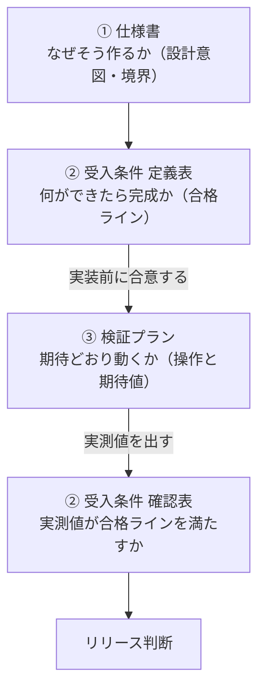

# 受入条件表と確認表の使い方

2026-08-05 ／ 従業員管理機能 ／ 対象：エンジニア・PdM・引継者・経営

---

## 1. 4つの資料の役割

**②が2回登場するのが要点です。** 実装前は「**約束**」、実装後は「**判定**」として使います。
だから合格ラインは定量（「〜＝0件」「〜＝0円」）でなければ機能しません。

| 資料 | 何のためのものか | 記入するか |
|---|---|---|
| **定義表** `..._受入条件表.tsv` | **何を満たせば合格か**を定義する | **しない**（読む表） |
| **確認表** `..._受入条件_確認表.tsv` | **実装が条件を満たしたか**を判定する | **する**（判定・実測値・確認日・確認者） |
| **検証プラン** `..._検証プラン.tsv` | **操作した結果**が期待どおりかを確かめる | **する**（スクショ貼付欄・実際の値・判定・所見・気づき・実施日・実施者） |
| ヘルプページ `..._マニュアル版.md` | **顧客に案内する内容**。検証プランの「ヘルプページ該当箇所」列で相互に辿れる | しない |
| 仕様書 `..._仕様書_PdM版.md` | なぜその設計にしたか | しない |

---

## 2. 定義表の使い方

**使う人**：エンジニア（実装前・実装中）／PdM・経営（リリース判断時）
**使うタイミング**：実装に着手する前に、この表で**合意**します。

### 読む順番

| 順 | 見るもの | 判断 |
|---|---|---|
| **①** | **L0 リリース不可（5件）** | 1件でも不合格なら**リリースしません**。過去が動く・締めても動く・店舗別が全社と合わない、のいずれかが起きている状態 |
| **②** | **L1 MVP必須（47件）** | 業務が回る最低ライン。「不合格のときリリースは」列が**不可**＝落とせない／**条件付きGo可**＝手作業で代替してリリースできる |
| **③** | **L2 次段階（9件）** | あると良いが無くても回る。**判断材料には使わない** |

### 列の意味

| 列 | 使い方 |
|---|---|
| 判定レベル | L0／L1／L2。リリース判断の階層 |
| 実装マイルストーン | M1データ基盤／M2計算／M3締め／M4画面・入出力／M5移行／次リリース |
| **価値MVP** | この条件が成立させる価値（V1 数字が動かない／V2 実態を表す／V3 自分で運用できる） |
| **解く課題** | なぜこの条件があるか（P1〜P4・K2〜K4 など） |
| 守る設計 | どの設計原則を守るか（原則①②③・移行・データ保全・入出力・画面） |
| 満たすべき状態 | 実装が満たすべき振る舞い |
| **合格基準（定量）** | **判定に使う数値**。ここが「0件」「0円」なら曖昧さなく判定できる |
| **実装の目安** | **エンジニア向け。どこまで実装されていれば合格か**（実装手段の指定ではなく、満たすべき条件） |
| 確認方法 | **操作で確認**（40件）／**操作＋実装レビュー**（13件） |
| 不合格のときリリースは | ★中止／不可／条件付きGo可／影響なし |

### エンジニアの使い方

1. 着手前に、担当するマイルストーンの条件を読む（例：M1なら8件）
2. 「**実装の目安**」が満たせる設計になっているかを確認する
   - 例：AC-07「履歴テーブルはINSERTのみ。UPDATE/DELETEを行わない」
   - 例：AC-11「実績給与×ヘルプ時間÷総労働時間で按分し、端数を所属店舗に寄せる。加算のみの実装は不可」
3. 疑問や無理があればこの時点で指摘する（**実装後だと作り直しになる**）
4. 実装できたら **確認表**（`20260805_従業員管理_01_確認表.xlsx`）のN列にOKを入れる。上部の確認ステータスが自動更新される

---

## 3. 確認表の使い方

**使う人**：引継者・PdM（検証時）／経営（リリース判断時）
**使うタイミング**：M3検証（8/12〜13）と、リリース判定（8/14）

### 記入の手順

1. **確認表をスプレッドシートにアップロードする**（`.tsv` のままインポートできます）
2. **判定列をプルダウンにする**
   データ → データの入力規則 → リストを直接指定 → `合格,不合格,未実装`
3. 上から順に条件を見る。**「確認する画面」と「操作」の欄のとおりに操作**する
   - 詳しい手順が要るときは「検証ID」欄のケースを**検証プラン**で開く
4. **判定を選ぶ**
   - **合格** … 合格基準を満たした
   - **不合格** … 操作できたが基準を満たさない
   - **未実装** … その機能がまだ無い
5. **実測値・所見**に、実際に出た数値や気づきを書く（例：`実績給与 338,000円`／`警告は出るが文言が違う`）
6. **確認日・確認者**を入れる

### 判定のルール

**条件の合否は「検証ID」欄のケースが<u>すべて合格</u>なら合格**です。1つでも不合格なら、その条件は不合格になります。

例：AC-16（締め済みの月は数字が動かない）は `T-S03 T-S04 C-008 R-02` に紐づいています。**すべて合格して初めてAC-16が合格**です。

### 確認方法が「操作＋実装レビュー」の15条件

**画面を操作しただけでは判定できません。** 実装物（スキーマ・API・コード）を提示してもらって確認します（検証プランの R-01〜R-06）。

| 条件 | 操作では合格に見えるが |
|---|---|
| AC-43 必須未入力で保存しない | 画面側だけのチェックでも合格に見える。**APIを直接呼べば不正な登録ができる** |
| AC-41 締めは会社スコープのみ | ボタンを画面側で隠すだけでも合格に見える。**APIを呼べば店長でも締められる** |
| AC-22 表記ゆれの吸収 | 列名をコードに埋め込んでも取込は成功する。**次の勤怠システムで開発が必要になる** |
| AC-35 個人単位でも同じ数字 | 画面ごとに別計算でも、いまは同じ数字が出る。**改修のたびにずれる** |
| AC-07・11・16・23・24・40・42・47 | 同上（R-01〜R-06で裏を取る） |

---

## 4. リリース判断の出し方

すべての判定を入れたら、次の順で見ます。

| 順 | 確認 | 判断 |
|---|---|---|
| **1** | **L0（5件）がすべて合格か** | 1件でも不合格 → **No-Go（リリース中止）** |
| **2** | 「不合格のときリリースは＝**不可**」の条件がすべて合格か | 未達あり → **設計MVP未達**（手作業で代替できないため出せない） |
| **3** | 残りが「**条件付きGo可**」だけか | → **条件付きGo**（CS手作業で補い、次リリースで解消） |
| **4** | すべて合格か | → **Go** |

**L2（次段階9件）は判断に使いません。**

> **確認表のビューア** https://suguru789987.github.io/rakmy-employee-mgmt-spec/acceptance-check.html
> 判定を選ぶと、上部にこの判断が自動で出ます。記入内容はTSVで書き出せます。

---

## 5. 検証当日（8/12〜13）の進め方

| 順 | やること | 使う資料 |
|---|---|---|
| 1 | 準備11行（S-01〜S-11）を上から実施。データ投入・締め状態の初期化・移行前の記録 | 検証プラン |
| 2 | 操作の検証（一覧→登録→詳細→履歴→実績→締め→取込→出力→取込データ→横断） | 検証プラン |
| 3 | 計算の検証。C-000（データの初期化）→ C-001 → C-003 → C-005 → C-006 → C-011 → C-013 → C-017 → **C-008は最後**（2026-05の金額を変えるため） | 検証プラン |
| 4 | 実装レビュー（R-01〜R-06）をエンジニアと実施 | 検証プラン |
| 4b | 「ヘルプページ該当箇所」列でヘルプページの記述と実装が一致するか確認（顧客に出す文書のため） | 検証プラン＋ヘルプページ |
| 5 | ケースの結果を**条件単位に集約**して判定を記入 | **確認表** |
| 6 | リリース判断を出す | **確認表**（上部に自動表示） |

### 先に決めておくこと（当日に「できませんでした」を防ぐ）

| # | 内容 | なぜ |
|---|---|---|
| **1** | **T-D05（予約の自動適用）の実施方法** … ①前日に仕込んで翌日確認 ②システム日付を進める ③バッチを手動実行 のどれか | **日をまたぐ必要がある**ため、決めていないと2日枠で判定できない（AC-05が判定不能になる） |
| **2** | **T-Z01〜T-Z03（移行）のリハーサル段取り** … 実行手順・実行者・タイミング | ★No-Go判定に直結する条件（AC-01・02・03）。実施できないと判定不能のまま |
| **3** | **R-01〜R-06にエンジニアの同席** | 実装物を見せてもらう必要がある |

---

## 6. よくある迷い

**Q. 一部のケースだけ合格のときは？**
条件は**不合格**です。紐づくケースがすべて合格して初めて条件が合格になります。所見に「T-S03は合格、C-008が不合格」と書いてください。

**Q. 「不合格」と「未実装」はどう使い分ける？**
操作はできたが基準を満たさない → **不合格**。機能自体が無い → **未実装**。リリース判断ではどちらも「合格していない」として扱いますが、**エンジニアへの戻し方が変わります**（不合格＝修正／未実装＝実装）。

**Q. 検証プランを実施していない条件も判定していい？**
できます。確認表には「確認する画面」と「操作」があるので、この表だけで確認できます。ただし**計算系（C-）と実装レビュー（R-）は検証プランの手順が必要**です。

**Q. L2の条件は空欄のままでいい？**
はい。判断に使いません。余裕があれば記入してください。

**Q. 検証IDに欠番があるのはなぜ？**
検証ケースを統合したときに空いた番号です（計算系の C-02・C-04・C-07・C-09・C-10・C-12・C-14〜C-16）。**番号は詰めません。** 受入条件表・確認表・ヘルプページから検証IDで参照しているため、詰めると参照が全部ずれます。**ケースが抜けているわけではありません**（計算系は C-000 を含めて9件で全数です）。

**Q. 定義表を直したくなったら？**
**実装が始まってからは、原則として変えません**（約束が動くと判定できなくなります）。変える場合は、なぜ変えるかを仕様書の判断記録に残し、影響する検証ケースも直してください。

**Q. スプレッドシートで見やすくするには？**
判定列に条件付き書式を入れると分かりやすくなります（`合格`＝緑／`不合格`＝赤／`未実装`＝グレー）。判定レベル列でフィルタして、**L0の4件だけを最初に確認**する使い方を推奨します。

---

## 7. ファイルの場所

| 資料 | ファイル | 公開URL |
|---|---|---|
| 定義表 | `20260803_02_従業員管理_受入条件表.tsv` | https://suguru789987.github.io/rakmy-employee-mgmt-spec/acceptance.html |
| 確認表 | `20260803_02b_従業員管理_受入条件_確認表.tsv` | https://suguru789987.github.io/rakmy-employee-mgmt-spec/acceptance-check.html |
| 検証プラン | `20260803_03_従業員管理_検証プラン.tsv` | https://suguru789987.github.io/rakmy-employee-mgmt-spec/test-plan.html |
| 実装マイルストーン確認 | （ビューアのみ） | https://suguru789987.github.io/rakmy-employee-mgmt-spec/milestone.html |
| 仕様書 | `20260803_01_従業員管理_仕様書_PdM版.md` | https://suguru789987.github.io/rakmy-employee-mgmt-spec/pdm-spec.html |
| 検証データセット | `data/` 20ファイル | トップページからダウンロード |

**TSVのままスプレッドシートにインポートできます**（区切り文字は自動検出）。Excelでもダブルクリックで開きます（BOM付きのため文字化けしません）。
